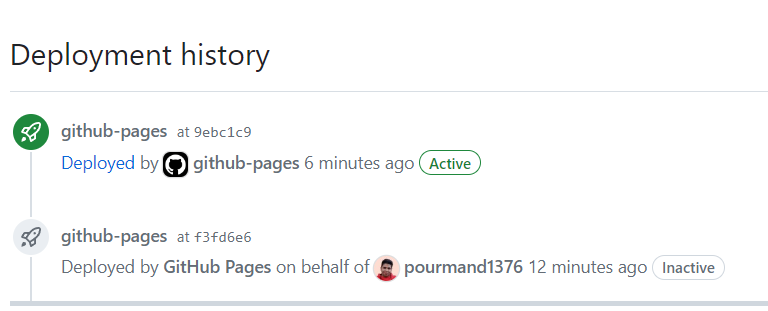
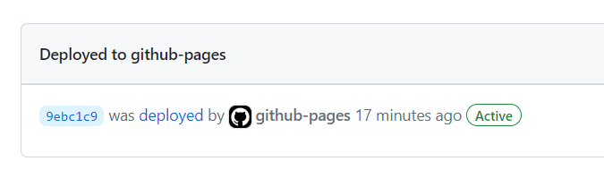
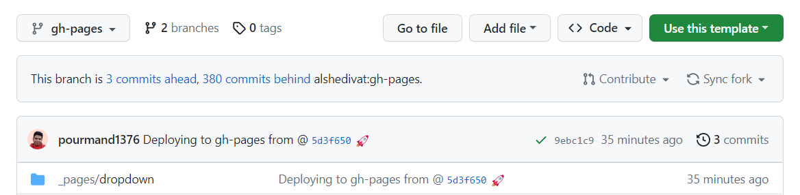

Here I want to guide you toward setting a Jekyll website with `al-folio` template. This is the template I am using for my website and I love it. I have also made some contributions to make it more usable (specially on docker side).  

> You do not need to install Jekyll, Docker, Ruby or even clone the repo in order to build and publish a website. You can do it all online and not even bother installing any of them. 

## Initial Setup
### Step 1
For this tutorial, I use my a GitHub organization called `al-folio`. You should replace all with yours!

First, you have to clone this repository as `al-folio.github.io` (if you have already clone, just rename it to what I've said). Make sure to check `only master branch` when forking as you do not need other branches. 

Then Go to Actions Tab and Enable `GitHub Actions`.


Then you need to change `url` into `al-folio.github.io` and change `baseurl` into nothing! Just like this:

```yaml
url: https://al-folio.github.io # the base hostname & protocol for your site
baseurl: # the subpath of your site, e.g. /blog/
```

Wait for some time until Github Actions finish. You can go to `Actions` tab and see its progress. Here, we only need `Deploy` Action to pass. Other actions are not important for now. 

Wait some time as it may last up to 5 minutes. 

Now, you should have `gh-pages` branch (deploy action will create it). Go to main page of your repository and check it.  

### Step 2
Now, go to `Repository Settings` > `Pages`.

Choose `gh-pages` branch and root directory just like me. 


Now, Github actions will try to build `Page Build and Deployment Action`. If it is successful your website should be up and running in 10 minutes. 

Why 10 minutes?
After performing all the required actions, the `github-pages` bot comes into play. Its primary function is to fetch the newly generated website and publish it to the web. However, in some cases, there might be a delay before your changes become visible to others.

### Debug! 
You can check status of `github-pages` using Environments Section of your github repository. For example, here it says that `9ebc1c9` commit was deployed successfully by github pages. You can check this commit to the latest commit in `gh-pages` branch. 


You can also see from `gh-pages` branch that `9ebc1c9` is the last commit. It says that this was generated from `5d3f650` commit from master branch. This can become handy if you have problem and you do not know where is the source of the problem. 



> If you have problems, make sure that both of your Github Actions are successful. Make sure branch is set to `gh-pages` and also check your website url and baseurl. These are some most common problems people have in `Jekyll` websites. 

### Host on Netlify


### Summarize
To summerize the blog, two steps occur when publishing the website:

- First, `Deploy` Action deploys your `master` branch to `gh-pages`. It generates raw html and css. No jekyll here. 
- Second, Page Build and Deployment Action makes your `gh-pages` branch ready for publish. But It doesn't really publish it until `gh-pages bot` decides so! 

if you want to make more changes, stay with me. 

## Install Locally
Now, you have your website up and running. It is configured so that whenever you commit to a specific branch, your server (Github or Netlify or whatever) will go and build a fresh website for your use. 

However, it is hard to change it locally as you have to wait for some time until your website is build. I recommend that you also install your website locally to review your changes on the fly.

To do that, first clone your fork repository:
```
git clone git@github.com:<your-username>/<your-repo-name>.git
cd <your-repo-name>
```

Then use docker compose to see your website:
```
docker compose up
```

This will serve your website on `localhost:8080`. You can go ahead and change your website. 

Also, as one of the maintainers of al-folio, I highly recommend using it the docker way. Otherwise, you would have to install ruby and then jekyll and then lots of gem packages. After that you would deal with `imagemagic` and also `jupyter` dependecies. That's a lot of headache. You don't want to deal with that and more importantly, why would you care?

This is why I took a lot of time to learn docker and then make a `dockerfile` for al-folio. It is used by a lot of people and normally they have no problem at all. 

After viewing your website, you should be able to make changes to website. 

I think it is highly intuitive. You start with `_config.yaml`. You put your name and footer and header and lots of information about yourself in that file. 

Then you would go on `_pages` folder. There you could easily change your `about` page which is the main website page and also you would see information about other pages. 

Some explanation about the folders:
- `_pages` folder is actually the root folder that you should take a look at. 
- `_news` folder is for adding news to your website. It can show latest news on your achievements. 
- `posts` folder is for your blog. 
- `_projects` folder is used by `_pages/project.md` to generate your projects description.

I think by looking at sample website, you could easily change it all according to your needs and more explanation is not necessary. 
