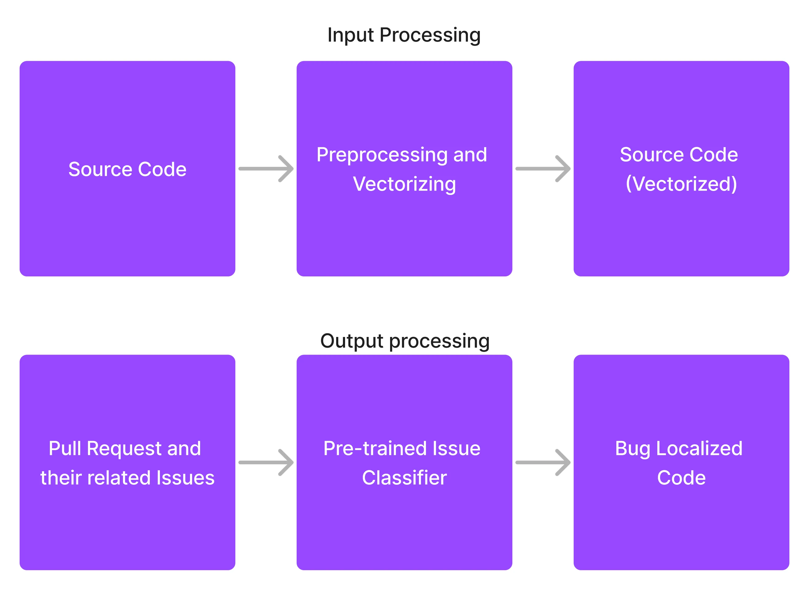
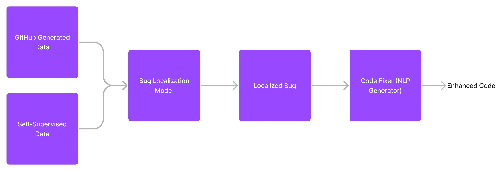

This is one of my tasks which I've done when applying to KU-Leuven University at a position (it was later filled by someone else). At that time, I thought getting a Ph.D. is my type. It was later that I've understood that I have no interest in following academic pathway and becoming a researcher. 

But, since I have taken some time (a couple of days) to prepare this research proposal, I think publishing it wouldn't be a bad idea. Perhaps someone uses this ideas. Perhaps not. 

Also, [here](SoftwareBug.pdf) is the pdf version which of this document which is also more polished. 

**Keywords**: Bug Detection, Bug Localization, Intelligent Software Engineering,
Machine Learning, Deep Learning

## Introduction

The detection and correction of software bugs has been a longstanding
challenge in software development. Bug localization is important in
large software projects due to its challenging nature and the impact it
can have on time and resources. There are two main reasons for this
difficulty. Firstly, there is a large number of bugs waiting for
localization, for example, Eclipse bug repository receives 200 bugs a
day near its release dates and Debian project receives 150
[^zhang2019finelocator]. Secondly, locating a bug in the source code can
take a significant amount of time, with research showing that most bugs
in PostgreSQL project take 100-200 days to resolve and 50% taking 300
days or more. The situation is similar in Tomcat project, where most
bugs take 40-200 days to resolve, with only 10% being resolved within 10
hours. In some cases, 5% of bugs may take almost two years to fix 
[^zhang2019finelocator]. Quickly resolving these bugs can save
significant time and money for the software project and its
stakeholders.

Despite the long-standing tradition of using static analyzers in bug
localization, these methods have their limitations and challenges.
Writing these analyzers can be a complex task requiring specialized
knowledge and a substantial amount of code, and there may be limited
incentives for developers to contribute to open-source projects like
linters [^neural_bug_finding]. These limitations and challenges
highlight the importance of finding new and innovative solutions for bug
localization.

Efforts are being made to expand the use of deep learning-based bug
detection techniques. These techniques hold the promise of enhancing the
software engineering process. However, there are still many obstacles to
overcome, such as developing reliable bug detection and repair methods
that can handle a variety of common bugs without relying on large
amounts of pre-labeled data [^self_supervised_bug_detection].

The structure of the paper is as follows: First, we talk about what we
try to achieve, then we see some related work. After that, we talk about
our methodology and finally, we mention a step-wise plan on how to solve
this problem.

## Problem Statement

The primary objective of this project is to identify and repair software
bugs. To this end, we seek to answer the following questions:

-   Q1: Is it possible to develop an efficient method for bug finding
    and fixing?

-   Q2: How efficient are machine learning models for detecting commonly
    encountered bugs?

-   Q3: What are the drawbacks of such machine learning systems? When do
    they perform poorly?

-   Q4: How influential is the size of the dataset in relation to other
    factors?

-   Q5: To what extent do supervised and self-supervised data contribute
    to bug identification?

Also, we want to investigate the idea of combining security issues and
bug finding. We want to see if we can address both problems by the same
architecture but different input and output data. This is not the main
focus of this project but something which came into my mind.

## Related Works

In the field of software development, finding and fixing bugs is an
important part of the development process. There have been many
techniques developed over the years to help with this task, including
both traditional and machine learning-based methods
[^neural_bug_finding].

Static bug finding involves scanning the source code for specific bug
patterns. Tools like Error Prone and Infer, which are used by companies
like Google and Facebook, are examples of these techniques. However,
creating and fine-tuning these tools often requires significant manual
effort. There is also the issue of false positives, where a bug detector
reports a bug that doesn't actually exist. To address this, researchers
have explored ways to prioritize bugs generated by these tools as a way
of classifying warnings and bugs [^kim2007warnings].

In the last decade, researchers in software engineering and programming
languages have discovered that valuable information about bugs can be
obtained from the ambiguous information in code, such as variable names
and comments. This is because patterns in source code, such as those
found in names, control, and data flow, can be informative. This
information can then be used to detect bugs. DeepBugs, for example, uses
the names of variables and methods to identify buggy code. They also
used generated (fake) bugs and they found that using these fake bugs
helped the program find real bugs in code. [^deep_bugs]

There have also been studies of the effectiveness of traditional bug
finding techniques, as well as studies of the impact of data imbalance
on machine learning models for software defect prediction. Data
imbalance refers to the fact that the number of buggy examples in a
dataset may be much smaller than the number of non-buggy examples. To
address this, researchers have explored techniques like under-sampling,
over-sampling, ensemble learning and synthetic sampling
[^neural_bug_finding].

Recently, researchers have been exploring automatic label generation,
known as self-supervised learning. Microsoft's BUGLAB is an example of
this research. BUGLAB draws inspiration from self-supervised learning
concepts in deep learning, computer vision, and NLP. Unlike traditional
bug detection methods that require real-life bug data, BUGLAB trains a
bug detection model without it. BUGLAB is similar to ELECTRA, but
utilizes a more sophisticated code rewriting approach and is used
directly for bug detection. The objective of BUGLAB is similar to that
of Generative Adversarial Networks. BUGLAB trains two models: a detector
model that finds and fixes bugs in code, and a selector model that
creates buggy code for the detector to use for training. The authors
tested BUGLAB using a Python implementation and found it was up to 30%
better than other methods on a dataset of real bugs, and even found 19
unknown bugs in open-source software. [^self_supervised_bug_detection].

## Methodology

### Data Gathering

Gathering accurate, comprehensive data is essential for making informed
decisions. In this project, we have used two approaches to gather data:
meta-data analysis and self-supervised approach.

It is essential to note that the level of granularity is a key factor in
this problem. The smallest unit of data that is used as input for the
model can either be a file, class, or method. Previous studies have
demonstrated the effectiveness of using methods as the smallest unit, so
this was chosen as the granularity level for this project.

#### Meta-Data Analysis

This method involves the use of data from issues and pull requests to
find buggy code. This is easy to do, as many github repositories use
predefined tags such as bug, issue to address bug-related issues.
Additionally, issues will often have a direct relation to pull requests,
as most standard repositories have some related issues to each PR. This
approach is illustrated in below figure. 

Figure 1: Generating Appropriate Input and Output labels from Github Repositories

#### Self Supervised Approach

In this approach, we make some changes to code to make it incorrect.
This is accomplished by using ideas such as variable misuse, argument
swapping, wrong operator, and wrong literal
[^self_supervised_bug_detection].

### Bug Localizer

Our task is to accurately pinpoint a set of probable locations for a
bug. This is easy enough for generated data, as we would be aware of
where the bug is placed. For public datasets, we assume that the altered
lines are somehow related to the bug and mark them as such. We then
train a model to assess how well bugs can be localized within the code.

An alternate idea involves breaking our assumption about PR code and
recognizing that not all modified code is necessarily bug-related. We
could then employ a pre-trained ML model to detect which code is most
likely to be identified as a bug. However, we do not test this concept
in the early stages as it would add complexity to the model, and we
believe that the most successful AI models are the simplest ones.

Figure 2: Proposed Model

### Bug Fixer

Source code and localized bug data which was created in the preceeding
stage of the model can be used as the input of the model, while the
modified code serves as its output. This model should be designed in the
form of a generator, which attempts to generate recommended code. This
can be formulated via a next-token prediction task, which is a
conventional strategy in natural language processing.

## Stepwise description of Workplan

### Replicate Previous Works

To improve upon existing works, we need to be familiar with the
challenges in the field and create a baseline to work off of. An article
from the Microsoft team [^self_supervised_bug_detection] has been chosen
to provide this baseline. In order to make improvements, we need to
understand the structure of the code and make it possible to learn from
public data sources instead of relying solely on generated bugs.

In this step, we will both generate buggy datasets and also train an ML
model which identifies and fixes bugs based on the dataset.

### Data Gathering

Then, we must obtain information from our sources. Here, we must extract
information concerning Code, Issues, Pull Request and Actions. We can
take advantage of the official GitHub REST API to crawl this data, a
common approach that is well-documented [^github_api]. This way, we can
quickly access code history, issues, pull requests, and GitHub Actions
meta-data. The only limit we may face here is the limitation of 5000
requests per hour set by GitHub [^github_api_limit]. This barrier can be
alleviated to some extent by using GraphQL instead of REST API
[^github_limit_solution].

### Data Labeling and Preprocessing

We need to filter out the Pull requests and focus on those that are
related to an issue which introduces a bug. To begin with, we can use a
simple approach and only take issues which have a label of \"bug\".

This process can be made more flexible through the use of a model, if
necessary. There are pre-trained datasets that are specifically designed
for this purpose. They take an issue and classify them as bug,
enhancement, feature and question [^issue_classification].

We Should also preprocess source code as illustrated in figure 1. 

### Training

Then, we should train a classifier to detect bugs in the code. It should
be able to assess whether a method contains an error or not and also
provide the probability that the error exists in the code. Additionally,
it should output an array that states which lines of the code contain
errors (if any).

After that, we would take the output result and train an NLP generator
to generate better code. The input should be the code and the output
should be the proposed Pull Request code. The model should be able to
provide PRs that are of the same quality as those written by
professionals.

### Optional Steps

When an initial model is proposed which is actually working, we can add
in more information from other sources. This includes GitLab and also
private repositories which we will have access to.

We can also build a GitHub bot to continuously monitor GitHub
repositories, evaluate pull requests, and suggest any necessary
modifications. Additionally, it can alert users if the code has a high
likelihood of containing a bug.

## References
[^self_supervised_bug_detection]: Allamanis, Miltiadis, Henry Jackson-Flux, and Marc Brockschmidt. 2021.
“Self-Supervised Bug Detection and Repair.” arXiv.
<https://doi.org/10.48550/ARXIV.2105.12787>.

[^github_api]: “GitHub REST API.” n.d. <https://docs.github.com/en/rest>.

[^neural_bug_finding]: Habib, Andrew, and Michael Pradel. 2019. “Neural Bug Finding: A Study of
Opportunities and Challenges.” arXiv.
<https://doi.org/10.48550/ARXIV.1906.00307>.

[^github_limit_solution]: “Is there a way to increase the API Rate limit or
to bypass it altogether for GitHub?” n.d.
<https://stackoverflow.com/questions/13394077>.

[^issue_classification]: Izadi, Maliheh, Kiana Akbari, and Abbas Heydarnoori. 2020. “Predicting
the Objective and Priority of Issue Reports in Software Repositories.”
arXiv. <https://doi.org/10.48550/ARXIV.2012.10951>.

Johnson, Stephen C. 1977. *Lint, a c Program Checker*. Bell Telephone
Laboratories Murray Hill.

[^kim2007warnings]: Kim, Sunghun, and Michael D Ernst. 2007. “Which Warnings Should i Fix
First?” In *Proceedings of the the 6th Joint Meeting of the European
Software Engineering Conference and the ACM SIGSOFT Symposium on the
Foundations of Software Engineering*, 45–54.

[^deep_bugs]: Pradel, Michael, and Koushik Sen. 2018. “DeepBugs: A Learning Approach
to Name-Based Bug Detection.” arXiv.
<https://doi.org/10.48550/ARXIV.1805.11683>.

[^github_api_limit]: “Resources in REST API.” n.d.
<https://docs.github.com/en/rest/overview/resources-in-the-rest-api?apiVersion=2022-11-28>.

[^zhang2019finelocator]: Zhang, Wen, Ziqiang Li, Qing Wang, and Juan Li. 2019. “FineLocator: A
Novel Approach to Method-Level Fine-Grained Bug Localization by Query
Expansion.” *Information and Software Technology* 110: 121–35.

