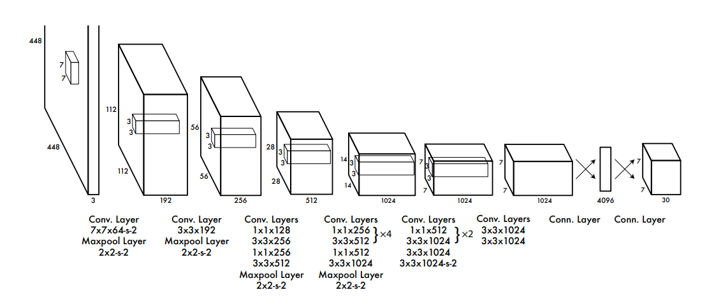
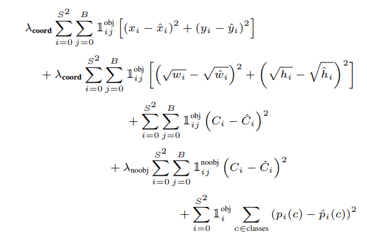

I've been thinking for some time about this and I want to share my thoughts about it. 

- What are the elements of a deep learning method?
- If I read a paper in DL world, what questions I should ask to see if I understand the paper properly?

This may seem trivial for some people as they intuitively understand it by reading some papers. Specifically, I've been reading YOLO-series papers and I always had a question in mind. What is the most important contributions in this paper?

I have understood that there are four elements that each Deep learning method should explicitly or implicitly mention. 

### Architecture
Deep learning is like a puzzle of functions. People change the order and type of functions from time to time. Sometimes, they are all into Convolutions. Sometimes, they takes RNN functions seriously and now this Attention function has come to the picture. 

I see the architecture as one of the most important things that change. Typically, papers can not answer "why" a certain function performs better. They just do some experiments and it seems better. So, they use it. 

After a while, if we use Darwinistic look, some functions that have very good performance, are selected and used worldwide. They even may be called state-of-the-art. 

They may even go further and provide some intuition about why that architecture (or specific function) works good. For example, they say that convolution is very near to how we, humans, see. But, I would rather see that as a simple function which has been tuned. 

For example, the above picture is about YOLO architecture. It takes a $488 \times 488$ image and outputs $7 \times 7 \times 30$. You can use whatever functions you want in the middle layers to get that output. It is by doing lots of experiments that researchers have understood that using an architecture like that is more helpful. 

There is no mathematical proof that it would work all the time. But it works just fine in most cases. This is why we use it. 

### Loss Function
So, we have an architecture which is like a massive nested function. How do we train this function? On what basis, should we train the parameters of this network?

This is where the loss function comes into picture. Here, you can use all your creativity to build a new function which helps to train the model better. 

It may be realistic. It may be not. 

Most of the time, people have some intuition of how the model should work. They build a function around that intuition and they create a new loss function.

For example, contrastive loss functions try to bring positive sample embedding pairs closer and push negative pairs apart in feature space. The intuition is that this embedding captures semantic similarity.

It is also possible that we have multiple goals in mind. In these scenarios, we define a function for each goal. Then, we use a weighted sum of the goals as loss function. 

Once again, this is YOLO loss. Take a look at it. 

It has multiple goals in mind and it has defined a function for each of those goals. Then there is a weighted sum ($\lambda_{coords}$ and $\lambda_{noobj}$) to understand the importance of each function. 

The rest of the function is just telling that $x$ and $y$'s should be close enough to their real numbers. Also, width and height should be close enough. 

Why there is a square root? It is shown by experiment that putting these values under a square root is just better. Often, No more explanation is needed. 

### Training Method
These days, training methods are fixed. Normally, people use SGD or ADAM and let them train the parameters of the model. 

We may also use some methods like learning rate scheduling to better train the model. This way, rather than keeping the learning rate static, we decrease it in discrete steps or gradually over epochs. This allows better convergence after initial fast training. 
### Input and Output
We should also pay attention to input and output. 

Sometimes, raw input is not passed to model and a pre-processing is needed. For example, raw images are often normalized by subtracting the dataset mean and dividing by standard deviation to improve training stability.

In some cases, we need to do some postprocessing on the output to make it usable. As an example, in classification, model outputs (logits) may be softened into probability scores via a Softmax function to get likelihood scores over all classes that sum to one.

## Conclusion
I have mentioned some important parts of a deep learning method. I think that first are the most important points in each Deep learning paper and I think if I read a paper and can not explain the loss function and the achitecture, I have understood nothing from that paper. 