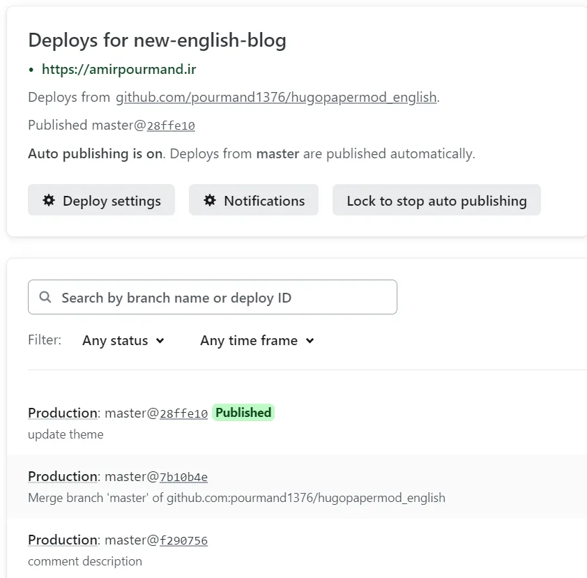
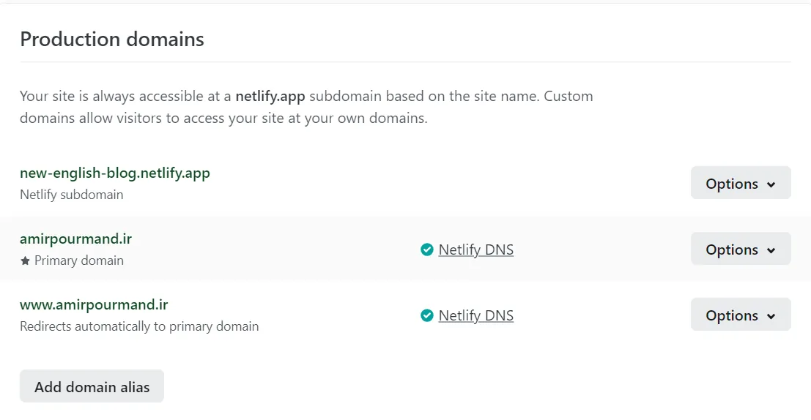
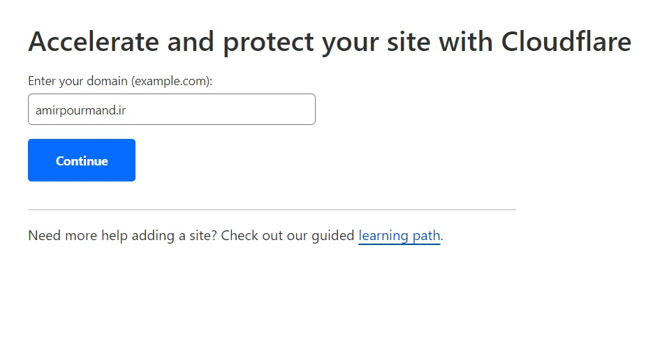
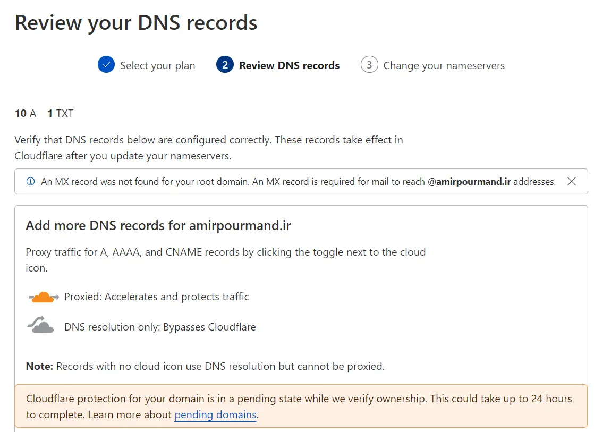
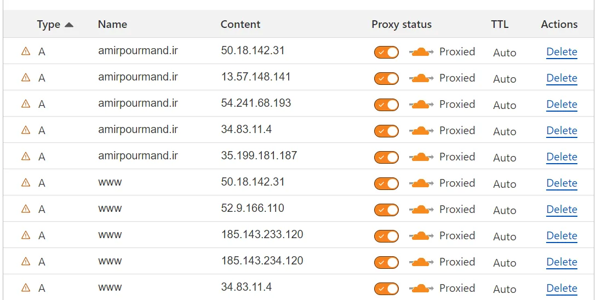
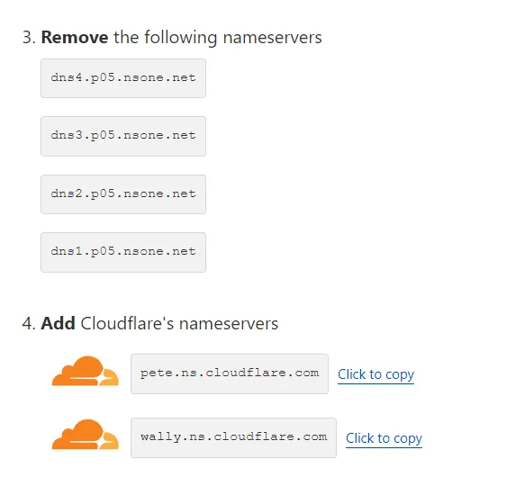
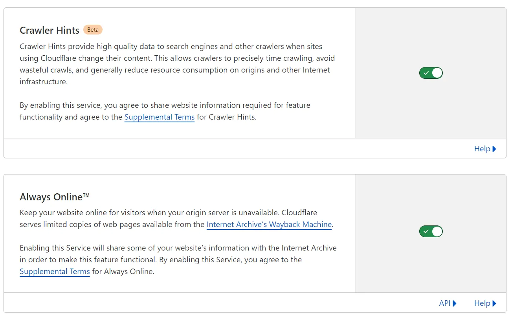
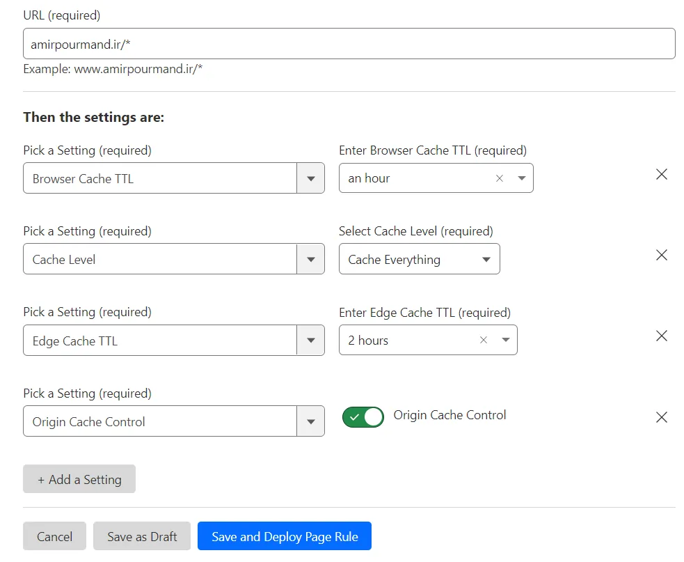
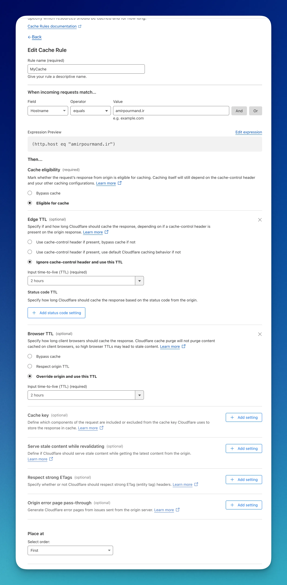

I host my hugo website on Netlify but since Netlify services are limited in my country, I have to use cloudflare CDN. Here's how I do it.

## Step 1
Configure your website on Netlify like normal. 

## Step 2 
- Go to [Cloudflare Dashboard| Web Performance & Security](https://dash.cloudflare.com/) and Login. 
- Then Click on **Add a site**. 
- You can then enter your domain name. 
- Choose **Free** Plan

- Review your DNS records and just press Continue! This will appear only one-time. It will determine addresses that you are currently using for your website and add them to DNS Records. 

## Step 3 
You should now change your DNS nameservers to what Cloudflare recommends. 

After doing this step, your website would be transferred to Cloudflare. 
## Step 4 (Optional)
You are now using Cloudflare. However, you won't get the real benefits from a CDN until you set some configurations. You have to set some cache in order to allow Cloudflare servers to cache your website. 

> Note that when you post an update to your website, it may take up to 2 hours for your changes to take effect. However, in my opinion, the wait is worthwhile as this approach significantly improves the speed of my website.

Now, go to **Caching** -> **Configuration** and Enable this two settings. 

After that, go to **Rules** -> **Page Rules** -> **Create Page Rule** and add a configuration like this:

> This step has been previously deprecated since `Page Rules` are being replaced ([+](https://developers.cloudflare.com/rules/reference/page-rules-migration/)). To fix this problem, go into `Cache Rules` and set it like this. 
> 

> Also, Make sure to enable these settings
> - Speed -> Observatory
> - enable `Smart Tiered Cache`. 
> - Caching -> Configuration -> Crawler Hints and Always Online

I used this way for a long time. The only problem is that sometimes (maybe once in a year), netlify IP Addresses change and you have to remove the site and add it again. 
