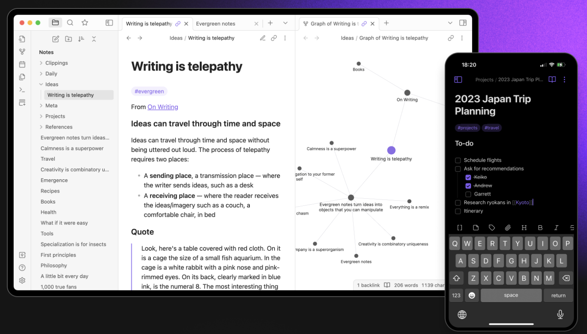

# Introduction
I've tried many tools and tutorials to sync my obsidian notes between android and windows. They all have the same problems:
1. Some need subscription service (Obsidian Sync) which I'm not willing to pay
2. Some can't handle editing the same file (Sync via GoogleDrive, Dropbox and ...)
3. Others need complicated setup and maintenance. 

# My Solution
This solution takes about 30 minutes to setup. But, once it is finished, it works perfectly. I have tested this solution for a long time. So, there shouldn't be any problem once you set it up. 

## Initial Setup
1. Create a Github or Gitlab Repository (Make sure it is `private`)
2. Create SSH-Key and add it to your `ssh-agent`
3. Clone your repository to a place in your device
4. Open that folder as a vault in obsidian
5. You can also move your current obsidian notes to this folder (in case you have any).

## Creating SSH-Key for Cloning Git Repo
If you don't want to read github documentation, here's how to do it quickly. 

First, you create an ssh-key using:

```shell
cd ~
ssh-keygen -t ed25519 -C "your_email@example.com"
```

Press Enter if you see any messages. It will ask about where to store the file and also the password. It doesn't matter. Then Enter this command to see your public key:

```bash
cat  ~/.ssh/id_ed25519.pub
```

Copy all the output into your clipboard. Then login to your Github account and Go to `Settings -> SSH and GPG keys -> Add ssh-key`. Then add your ssh key to your account. 

You can now go into your repository and copy your ssh url and then use it for cloning. 


## Sync Windows and Mac
For windows and mac, you can just install `obsidian-git` plugin. Installing that would be a breeze. Just make sure to set automatic pull and push (I've set it to 5 minutes). 

I've pinned these three commands since sometimes I want to instantly sync my changes. 
Obsidian > Options > Command Pallete > Pinned Commands

- Obsidian Git: Commit all changes
- Obsidian Git: Push
- Obsidian Git: Pull

[GitHub - denolehov/obsidian-git: Backup your Obsidian.md vault with git](https://github.com/denolehov/obsidian-git)
Also, here is the repo if you want to check it out. 


## Update 2023-10-08
This blog have gotten a lot of attention. So, I decided to simplify things and write a bash scripts which does all these stuff pretty automatically. 

To use it go to [this](https://github.com/pourmand1376/Obsidian-Sync) repository in github. 

You can skip the whole tutorial here if you decided to go with Github version. 

### ExtraOption for windows users
 Note that if you are using windows, you should also use this command to prevent path error on odd filenames ([+](https://stackoverflow.com/questions/63727594))
```
git config core.protectNTFS false
```

## Automatic Merging
Sometimes you may change the same file. I know it is rare but it is possible. We prevent conflict by two ways (gitignore and gitattributes).

These files need to be created at the root of your directory (where `.git` folder resides).
```
touch .gitignore
touch .gitattributes
```
First, You should add these lines to `.gitignore`:
```
.trash/
.obsidian/workspace
.obsidian/workspace.json
.obsidian/workspace-mobile.json
.obsidian/app.json
```
This tells git to ignore certain files that are likely to cause conflicts, like recently opened files.

Next, you'll add the `.gitattributes` file and tell git how to handle merging for specific file types. For example, you can tell git to treat markdown files as regular text files and merge them accordingly:
```
*.md merge=union
```
This instructs git to merge markdown files as if they were plain text. This way, you won't ever get a git conflict in markdown files even if you change the same line at the same time (the strategy in these situtations is to show both lines). 

In case you have previously committed `workspace.json` and other mentioned gitignore files into git, you should remove them using the following commands (If you are not sure, it wouldn't hurt to run these commands):

```bash
git rm --cached .obsidian/workspace
git rm --cached .obsidian/workspace.json
git rm --cached .obsidian/workspace-mobile.json
git rm --cached .obsidian/app.json
git commit -am "Remove gitignore files"
```

## Sync Android
For this part, I used [this tutorial](https://gist.github.com/Makeshift/43c7ecb3f1c28a623ea4386552712114) for the reference:

Here I assume that you have a fully working obsidian in your windows (or mac). If not, please first sync your windows (or mac) to Git and then follow the rest of this tutorial. 

To Use Git on Android:
- First, you'll need to download and install the Termux app from the Google Play Store ([Termux – Apps on Google Play](https://play.google.com/store/apps/details?id=com.termux&hl=en_GB&gl=US)). Once you have it installed, open the app and run the following commands 
```
apt update
apt upgrade -y
pkg install openssh -y
pkg install git -y
termux-setup-storage
```
These commands will update your Termux installation, install the necessary packages for Git, and set up your storage so you can access your files.
- Next, you'll need to add your Git configurations. Run the following commands:
```
git config --global user.email "<your_email>"
git config --global user.name "<The name you want on your commits>"
git config --global credential.helper store
git config --global pull.rebase false
git config --global --add safe.directory '*'
```

Replace `<your_email>` and `<The name you want on your commits>` with your own information. 

- Now you're ready to clone a repository. Use the following command (make sure to replace your repository url):
```
cd ~
mkdir obsidian
git --git-dir ~/obsidian --work-dir ~/storage/downloads/obsidian clone <your repository_github_url>
```

> Note that here we are separting git working directory and bare git directory. This is a must and the reason for taking this approach is explained [here](https://github.com/termux/termux-app/issues/3385). 

For Authentication, you have two ways. Use [Personal Access Tokens](https://docs.github.com/en/authentication/keeping-your-account-and-data-secure/creating-a-personal-access-token), or use [SSH](https://docs.github.com/en/authentication/connecting-to-github-with-ssh). I use the second as the first one is blocked in my country. 

You should now have the repository folder on your device and you should be able to open your obsidian files inside its app. If you haven't changes my commands, you should find your obsidian vault in `downloads/obsidian` folder. 

> Here, You should go to Settings -> Community Plugins -> Obsidian Git and make sure `Disable on this device` is checked (unfortunately this plugin doesn't work well on mobile).

But how do we sync obsidian? Bare with me. 

The first step is to add a `.profile` file to your Termux home directory. To do this, run the following commands:
```bash
cd ~
touch ~/.profile
echo "source ~/.profile" >> ~/.bashrc
echo 'function sync_obsidian
{
cd ~/obsidian
git add .
git commit -m "Android Commit"
git fetch
git merge --no-edit
git add .
git commit -m "automerge android"
git push
echo "Sync is finished"
sleep 2
}
alias ob="sync_obsidian"
alias o="sync_obsidian && exit"
alias 0="o"' > ~/.profile
```
These lines will create a function called `sync_obsidian` inside `.profile` that will take care of syncing your notes. 

That's all. You can now sync your obsidian vault using `0` or `o` alias in termux (Just type 0 and hit enter). 

> It's important not to use `git pull` in `sync_obsidian` function since it will prompt you for a merge commit message every time there are conflicts, which can be very annoying. [Why is git prompting me for a post-pull merge commit message? - Stack Overflow](https://stackoverflow.com/questions/11744081/why-is-git-prompting-me-for-a-post-pull-merge-commit-message)

Here is also a short video to see how this works inside Termux. 



## Note for iPhone Users
I do not own an iPhone. But one of my friends does and he followed [this](https://forum.obsidian.md/t/mobile-sync-with-git-on-ios-for-free-using-ish/20861) tutorial successfully. 

Only a few notes here:
- Apparently, there is no need to clone the way I said in android. Clone it normally.
- I think my script for syncing obsidian is much more robust and more importantly it makes you conflict-proof! 


Good Luck!
