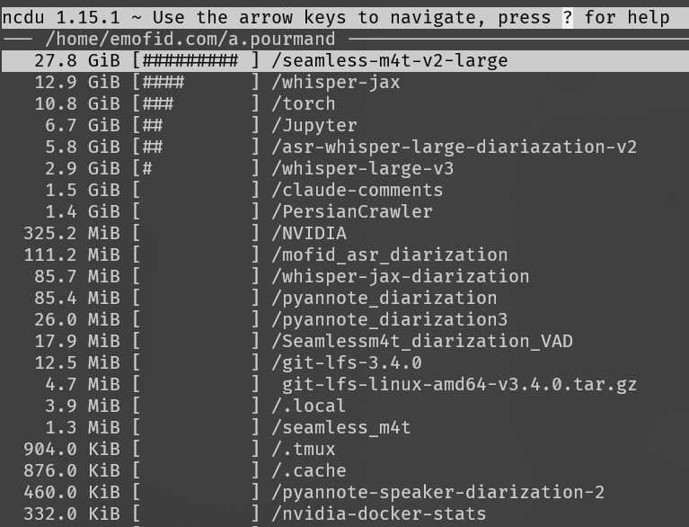
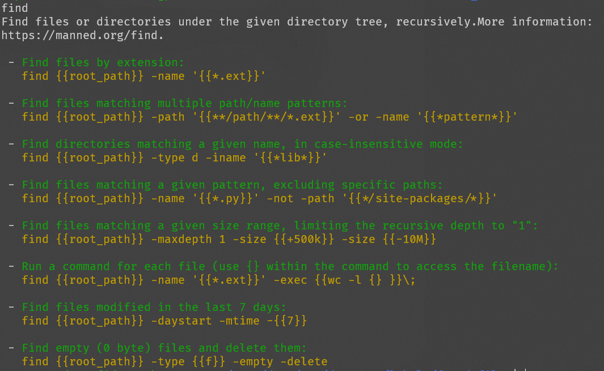

I've been working for some time with Linux and I feel that sharing some scripts and also tools I frequently use can be helpful. 

### Show File and Folder Size
To analyze file size, there are several ways. 

```sh
ls -alh 
```

```
-rw-r--r--  1 amir amir 270K May 20  2023 Arial.ttf
-rw-r--r--  1 root root   72 Sep 20 21:10 Untitled5.ipynb
-rw-r--r--  1 amir amir 1.2M May 26  2023 exp12.mp4
-rw-r--r--  1 amir amir 4.7M May 26  2023 exp13.mp4
-rw-r--r--  1 amir amir 654M May 22  2023 exp4.avi
-rw-r--r--  1 amir amir   68 Dec 28  2022 kaggle.json
drwxr-xr-x 17 amir amir 4.0K Dec 28  2022 miniconda3
drwxr-xr-x  2 amir amir 4.0K May 26  2023 mp4
```

You can see from the above output that this only shows file sizes properly. 

On folders, I use:

```sh
du -h --max-depth=1
```

(Optional) To sort it:
```sh
du -h --max-depth=1 | sort -hr
```

Of course, this is when I do not have access to **sudo**. In case of sudo access, I will pretty much always install `ncdu` via:

```sh
sudo apt install ncdu
```

This way, I would be able to easily navigate between folders and find out which folder is taking the most space. 


### Test Access to a Server or Service
This is especially the case in big companies when you should request access for a server. They may give the network access to you but not SSH access. Or you may just want to troubleshoot your network and what not. 

```sh
ping ip
telnet ip port
nc -v ip port
```
for example:
```sh
ping 10.2.10.4
telnet 10.2.10.4 22
nc -v 10.2.10.4 22
```

### Show Network Ports Already being Used
This is especially useful for docker images when you want to spin up a docker image and you want to specify a new port to it. 

```sh
netstat -nlpt 
```

```
(Not all processes could be identified, non-owned process info
 will not be shown, you would have to be root to see it all.)
Active Internet connections (only servers)
Proto Recv-Q Send-Q Local Address           Foreign Address         State       PID/Program name
tcp        0      0 0.0.0.0:22              0.0.0.0:*               LISTEN      -
tcp        0      0 0.0.0.0:8017            0.0.0.0:*               LISTEN      -
tcp        0      0 0.0.0.0:8019            0.0.0.0:*               LISTEN      -
tcp        0      0 0.0.0.0:8018            0.0.0.0:*               LISTEN      -
tcp        0      0 0.0.0.0:8081            0.0.0.0:*               LISTEN      -
tcp        0      0 0.0.0.0:8080            0.0.0.0:*               LISTEN      -
tcp        0      0 127.0.0.53:53           0.0.0.0:*               LISTEN      -
tcp6       0      0 :::22                   :::*                    LISTEN      -
tcp6       0      0 :::8017                 :::*                    LISTEN      -
tcp6       0      0 :::8019                 :::*                    LISTEN      -
```

### Get Server Information
IP Address:
```sh
ifconfig -a | grep inet
```
Hostname:
```sh
cat /etc/hostname
```
Linux Kernel:
```sh
uname -a
```

Disk Space:
```sh
df -h
```
Memory and CPU usage:
```sh
htop
```

or maybe just install [Neofetch](https://github.com/dylanaraps/neofetch).
### Useful Terminal Tools to install
#### Watch Network Usage
```
sudo apt install iftop
```
#### Enable SSH Access to system
```
sudo apt install openssh-server
```
This way you can access your laptop (or server) via SSH easily. 

#### Find Documentation for a command
Let's say you want to read documentation for a command like `find`. You might do `man find` or `find --help` but none of them are easy to read. We can do better.

```
sudo apt install tldr
tldr --update
```

Install `tldr` (too long didn't read) and then use `tldr find`. This way you would find a much better and easy to follow documentation. Just take a look at it. Isn't that better?

