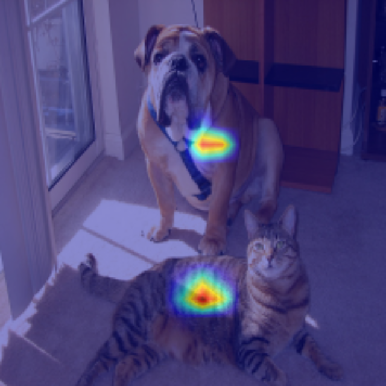

In this explanation, I'll be discussing methods for achieving interpretability in YOLOv5, a popular object detection model. While there have been several attempts to make YOLOv5 interpretable, it's worth noting that none of these methods are currently compatible with the latest version of the model.

My work is the marriage between [PyTorch-GradCAM](https://github.com/jacobgil/pytorch-grad-cam) and [YOLOv5](https://github.com/ultralytics/yolov5).

- [GitHub - jacobgil/pytorch-grad-cam: Advanced AI Explainability for computer vision](https://github.com/jacobgil/pytorch-grad-cam)
- [GitHub - ultralytics/yolov5: YOLOv5 🚀 in PyTorch > ONNX > CoreML > TFLite](https://github.com/ultralytics/yolov5)

## Usage
I want to use your work. Also, I do not care about how you did it. 
```python
from explainer.explainer import run
import PIL

image=run(source='cat-dog.jpg',method='GradCAM')
PIL.image.fromarray(image)
```
This is the easiest way. Just mention the name of the method and say its source image. Here, we make a **post-hoc** explanation (or interpretation) via **GradCAM** and return a heatmap. It could be something like this. 


You can see a full demo at `explainer/demo.ipynb` file. 

I have submitted a pull-request [here](https://github.com/ultralytics/yolov5/pull/10649). You can use the my code as soon as it is merged in the base repository. But, for now, you have to add it manually. All my code is written inside `explainer/explainer.py`. 

Also, you have to install Grad-Cam via:
```bash
pip install grad-cam
```
The version that I've tested is `1.4.6`. So, if you have problems you can use:
```bash
pip install grad-cam=1.4.6
```

## Arguments
### Layer
Our method includes a `layer` argument that indicates the layer from which to obtain `interpretations` or `heatmap`. The default layer for YOLO is -2, but you can select any layer you prefer. 

You can choose to provide a list of layers to generate an average heatmap for all of them using Grad-CAM. This feature works by extracting a heatmap from each layer in the list and then averaging them into a single heatmap. This approach can sometimes be better than the original method.

I use a single layer to extract a heatmap, however, you can pass a list of layers into `target_layers` if you want. 
```python
target_layers = [model.model.model.model[layer]]
```

A sample would be: 
```python
from explainer.explainer import run

run(source='cat-dog.jpg',method='GradCAM',layer=-3)
```

### Method
There are two categories of interpretability methods:
1.  Gradient-based methods: These include XGradCAM, LayerCAM, GradCAMPlusPlus, GradCAM Element wise, GradCAM, FullGradCAM, and EigenGradCAM.
2.  Gradient-free methods: These include AblationCAM and EigenCAM.

For now, I have supported all of the methods except `AblationCAM`. 

To change interpretability method, just use its name as input. Default is `GradCAM`. 

### Class Names
If you want to extract a post-hoc explanation only for specific classes and filter out others, you can use class names to do so. You can create an array of the desired class names and use it to filter out the unwanted classes. If the array is empty, the default behavior is to use all classes.

A sample would be:
```python
from explainer.explainer import run

run(source='cat-dog.jpg',method='GradCAM',class_names=['dog'])
```


### Backward Per Class
Sometimes, one class can dominate the other classes in a given dataset. In such situations, it is recommended to apply the backward method to each class separately and then average out the resulting heatmaps. This is exactly what `Backward_per_class ` does. 

```python
from explainer.explainer import run

run(source='cat-dog.jpg',method='GradCAM',backward_per_class=True)
```


### Backprop Array
This is one of the most complex arrays to understand, as it determines which item to use for backward computation. There are several options available, including `class`, `confidence`, `class_confidence`, `x_center`, `y_center`, `height`, and `width`.

By default, using class for backward computation is the best strategy, and it usually works well. However, you can choose to use other criteria such as confidence, x, or y for backward computation if necessary. This decision is entirely up to you.

Additionally, you can provide a list of items to use, and we will generate an average heatmap by performing backward computation for each of the items in the `backprop_array`. 

```python
if self.backprop == 'class':
	score = score + torch.log(class_score)
elif self.backprop == 'confidence':
	score = score + torch.log(confidence)
elif self.backprop == 'class_confidence':
	score = score + torch.log(confidence * class_score)
elif self.backprop == 'x_c':
	score = score + torch.log(x_c)
elif self.backprop == 'y_c':
	score = score + torch.log(y_c)
elif self.backprop == 'h':
	score = score + torch.log(h)
elif self.backprop == 'w':
	score = score + torch.log(w)
else:
	raise NotImplementedError('Not implemented')
```
Here is an example using `confidence` score. 


## Code Reasoning
In this section, I will provide an explanation for each line of code and the reasoning behind using it. 

### Why this?
Why there are lots of options and what do each mean? 

I suppose that you have seen Grad-CAM before. You know that it is fairly easy to use for lots of PyTorch models. You just backprop the class variable up to a layer and then visualize it. 

However, YOLO is different. We have a non-differentiable module called [NMS](https://towardsdatascience.com/non-maximum-suppression-nms-93ce178e177c) (Non-Maximal Suppression). In fact, it filters out overlapping boxes in YOLO to make predictions more accurate. 

So, before using NMS module, everything is differentiable. 

We just have to write a manual backward function for NMS. It doesn't have to be accurate. It can also be an approximation.

This main purpose of writing this blog is to show you how I did it. 

But first, you have to understand YOLOv5 output before NMS and after NMS. 

### YOLOv5 Output
#### DetectMultiBackend (Before NMS)
Most YOLO models define their loss function before performing non-maximum suppression (NMS). NMS is not a part of the model itself, which is trained and performs calculations, but rather a post-processing step used to filter out redundant bounding boxes.

In YOLOv5, `DetectMultiBackend` outputs this matrix. Note that all items in this matrix have their gradients enabled. 

The YOLO model outputs a matrix of size "NumberOfPredictions x Prediction," which can have tens or hundreds of thousands of predictions per image. This is why Non-maximum suppression (NMS) is necessary to filter out redundant bounding boxes.

When evaluating the model output, a tuple of two elements is returned. The first element is the prediction matrix, and the second element is a matrix containing head predictions one by one. Knowing what each head predicted can sometimes be useful.

```python
model = DetectMultiBackend(weights)
total_predictions,head_predictions=model(img)
```

However, as we do not need the second argument, we wrap the model output in a class and we return just its first argument. This is for the sake of simplicity, otherwise we needed to use `output[0]` everywhere in our code. 

This can be done with the following code:
```python
class YoloOutputWrapper(torch.nn.Module):
    """
    Main purpose of using this method is to eliminate the second argument in YOLO output.
    """

    def __init__(self, model):
        super(YoloOutputWrapper, self).__init__()
        self.model = model

    def forward(self, x):
        """
        first one is a 3 dim array which contains predictions
        second one is a list of heads with their corresponding predictions
        """
        total_prediction, _ = self.model(x)
        return total_prediction

model = YoloOutputWrapper(model)
_ = model(im)
```

[understand model output · Issue #5304 · ultralytics/yolov5 · GitHub](https://github.com/ultralytics/yolov5/issues/5304)

#### AutoShape (After NMS)
In YOLOv5, You can use `AutoShape` to see the model predictions after NMS. In fact, this is the default output when using YOLO. You can further access model results in pandas using this code:
```python

output=model(img)
output.pandas().xyxy[0]
```

It will output a matrix like this:


### Run()
This method is the starting point for my program. Here, I have used `DetectMultiBackend` and `AutoShape` to get the results before NMS and after NMS. 

I know that this can be optimized later for efficiency purposes, but currently I just want it to work. 

```python
model = DetectMultiBackend(weights, device=device, dnn=dnn, data=data, fp16=half)
model.requires_grad_(True) # this is necessary as we need to call backward
autoshaped_model = AutoShape(DetectMultiBackend(weights, device=device, dnn=dnn, data=data, fp16=half))
```

Then, I call `explain` method which chooses which method to use. 
```python
for _, im, _, _, _ in dataset:
        processed_output = autoshaped_model(im)
        predicted_bbox = processed_output.pandas().xyxy[0]
        #  list of detections, on (n,6) tensor per image [xyxy, conf, cls

        im = torch.from_numpy(im).to(model.device)
        im = im.half() if model.fp16 else im.float()  # uint8 to fp16/32
        im /= 255  # 0 - 255 to 0.0 - 1.0
        if len(im.shape) == 3:
            im = im[None]  # expand for batch dim

        model = YoloOutputWrapper(model)
        _ = model(im)

        # here we use the output from autoshaped model since we need to know bbox information
        cam_image = explain(method=method,
                            raw_model=model,
                            predicted_bbox=predicted_bbox,
                            classes=class_idx,
                            backward_per_class=backward_per_class,
                            image=im,
                            layer=layer,
                            use_cuda=use_cuda,
                            backprop_array=backprop_array)

        # for now, we only support one image at a time
        # then we should save the image in a file
        return cam_image
```

### ExtractCAM()
-   The method takes in several arguments, including the CAM explanation method to be used, the PyTorch model, the predicted bounding box coordinates, the class indices, a flag indicating whether to perform the backward pass per class or globally, the image data, the layer of the model to extract activations from, a flag indicating whether to use CUDA for GPU acceleration, a list of backpropagation targets, and any additional keyword arguments that may be required by the CAM method.
-   If no classes are specified, the method uses the classes present in the predicted bounding box.
-   The target layer of the model is extracted based on the specified layer index.
-   A list of CAM targets is created based on the predicted bounding box and backpropagation targets.
-   If `backward_per_class` is False, the CAM is computed globally for all classes and backpropagation targets. Otherwise, the CAM is computed separately for each class and backpropagation target.
-   The CAM is computed using the specified method, model, image data, and CAM targets.
-   The resulting grayscale CAM images are added to an array.
-   The final CAM image is obtained by summing the grayscale CAM images and normalizing the values.
-   The final CAM image is overlaid on the original image using the `show_cam_on_image` function.
-   The resulting CAM image is returned.

### Score (for backward)
This class is a custom implementation of a PyTorch target function for the CAM method. The purpose of this class is to assign a score to each bounding box in the predicted_bbox parameter based on how well the current bounding boxes match it in terms of intersection over union (IOU) and classification score (and other metrics). The total score is the sum of all the box scores.

Score is the metric that we call backward on it. So, it should have `requires_grad=True`.

What is it?
Score is what you want to backward. It should be a single number that you backward from things that are important to you to see how the model sees the world. 


Here's a breakdown of the code:

-   The class takes in three arguments: `predicted_bbox`, `backprop`, and `classes`. Predicted_bbox is a tensor containing the predicted bounding box coordinates, confidence scores, and class indices. Backprop is a string indicating which parameter to backpropagate through, and classes is a list of class indices to consider.
-   The **call** method takes in the output tensor of the YOLOv5 model and processes it to obtain the predicted bounding box coordinates in the xyxy format.
-   The iou_scores tensor is obtained by calculating the IOU between the predicted bbox and the processed bbox tensor.
-   The topk_iou_indices tensor is obtained by selecting the top k (in this implementation, k=10) similar boxes for each predicted bbox.
-   A score tensor is initialized with a value of 0 and requires_grad=True.
-   For each predicted bbox, the indices tensor is filtered to only include indices with the relevant class index.
-   The class_score tensor is obtained by taking the mean of the class index scores for the filtered indices.
-   The confidence tensor is obtained by taking the mean of the confidence scores for the filtered indices.
-   The x_c, y_c, h, and w tensors are obtained by taking the mean of the corresponding values for the filtered indices.
-   The score tensor is updated based on the backprop argument.
-   The final score tensor is returned.

In summary, this class is used to calculate a score for each predicted bbox based on how well it matches the processed bbox tensor in terms of IOU and classification score. The score is used in the CAM method to generate a class activation map that highlights the regions of an image that are most important for a given class prediction made by a YOLOv5 computer vision model.

Also, sometimes the model output was not consistent. So, I used it this way. 

```python
if len(output.shape)==2:
            output = torch.unsqueeze(output,dim=0)

assert len(output.shape) == 3
```


### More Explanation On Score
In order to determine which pixels have the most impact on the prediction for our boxes, we calculate a score by back-propagating information from the model. This score is essentially a form of loss, but it is useful for interpretability purposes.

To calculate the score, there are multiple ways to approach it. One common method is to sum all related class numbers. This is similar to approach taken [here](https://github.com/pooya-mohammadi/yolov5-gradcam). I have implemented this approach in `YOLOBoxScoreTarget`. 

There is also another method that Grad-CAM library proposes [here](https://jacobgil.github.io/pytorch-gradcam-book/Class%20Activation%20Maps%20for%20Object%20Detection%20With%20Faster%20RCNN.html). This is implemented for Faster-RCNN and I've taken this approach on `YOLOBoxScoreTarget2`. 

Here's the procedure:
- For each bounding box, I obtain 5 most similiar ones based on IOU score. 
- Then I take a mean of class_scores of those 5 boxes. 
- I add all these values to `score`. 
- Finally, The library would call backward on that score. 

Here's the code:
```python
bboxes_processed = xywh2xyxy(output[..., :4])
iou_scores = torchvision.ops.box_iou(self.predicted_bbox[:, :4], bboxes_processed[0])
_, topk_iou_indices = iou_scores.topk(k=10, dim=-1)  # get top 10 similar boxes for each of them
score = torch.tensor([0.0], requires_grad=True)
```

```python
softmax_result = F.softmax(values)
class_score = (output[0, indices, 5 + class_idx] * softmax_result).sum()
confidence = (output[0, indices, 4] * softmax_result).sum()
x_c = (output[0, indices, 0] * softmax_result).sum()
y_c = (output[0, indices, 1]* softmax_result).sum()
h = (output[0, indices, 2] * softmax_result).sum()
w = (output[0, indices, 3] * softmax_result).sum()
```

However, there are some questions:
- Why do you take softmax and then some over it?
This is actually a form of taking weighted mean over relevant boxes. I've found through experiment that using weighted sum is better than mean or sum. 

Also, there is a concern that if we use sum one box will dominate other boxes and if we use mean, we can not say that all boxes are important in the same way. Some have more overlap and should have more emphasis on them. 

- Why have you chosen to use 10 boxes? What not 1?
Simple answer is because I see that It works better. Choosing to backward more boxes instead of one shows more information and it is also more robust to noise. 