Recently, I wanted to have an easy way to send azure `Application Insights` notifications into Slack. 

Actually I am writing this tutorial two month after setting up this workflow and I hope I don't forget anything. This method has been working pretty good in the last couple of months. 

Note that this is mostly free and I am just using Azure Services (App Logic and Applications Insights) and [Slack Incoming Webhook](https://api.slack.com/messaging/webhooks) app (which is free).

Let's do it, step by step. 

### Step 1: Setting Up Azure Alerts

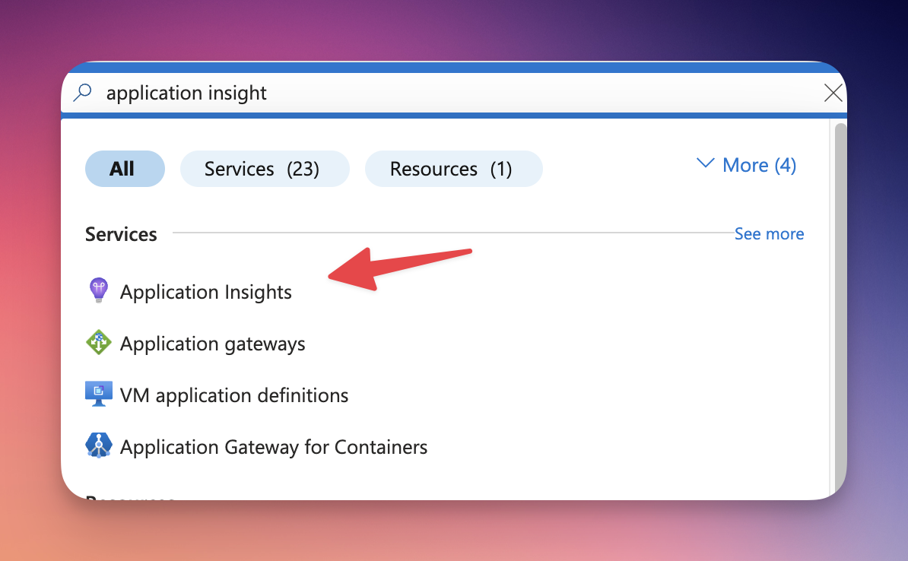

Create a new `Application Insight` if you don't have any. Then go into `Investigate -> Availability`. 

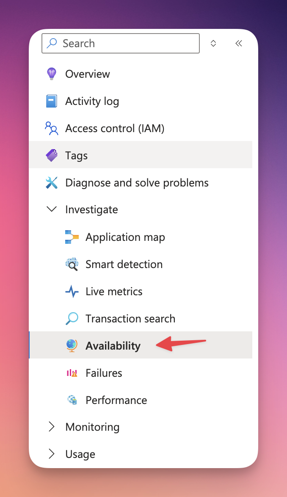
Here you can add some availability tests like I've done. 

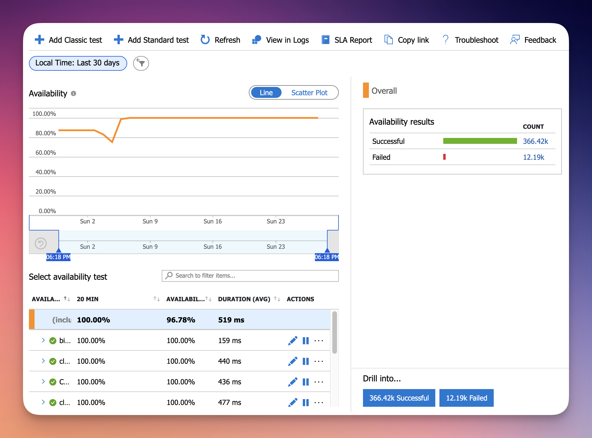

Adding is also easy. You can add `Standard Test` and provide your url to test on a regular basis. 

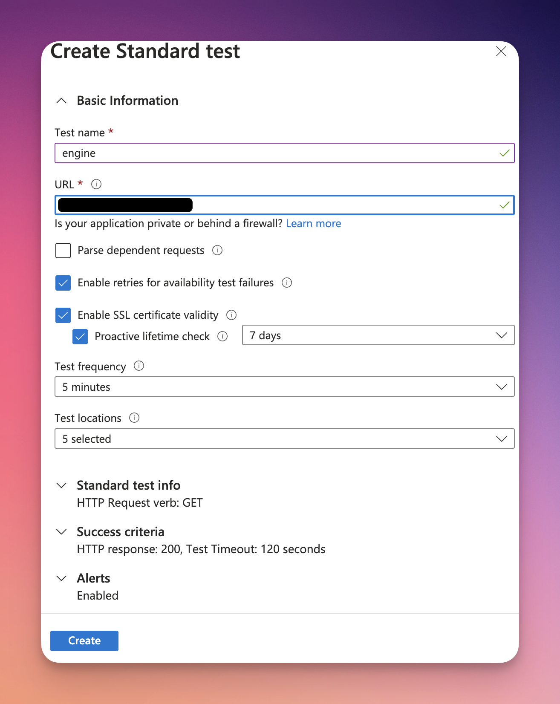

This was easy. What I wanted to do was to `Azure` inform all team developers when certain conditions are met. For example, I want to know, when a specific service is not available. 

So, In order to obtain that objective, right click on the Test that you have created and click `Open Rules Page` (if you don't see an rules, you should wait a little and try again). 

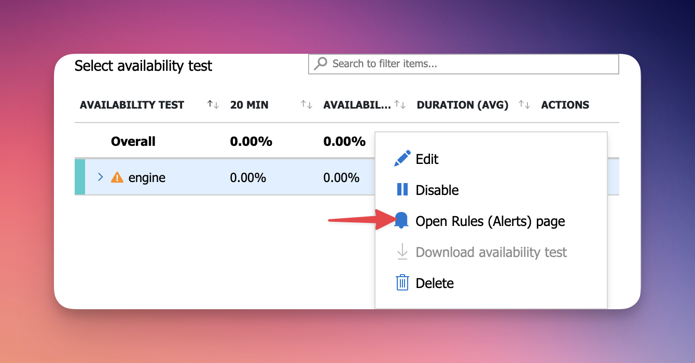

Azure should automatically create a certain rule for you. You can create whatever rule you want, but this one is OK in our case and this is exactly what I want. I want to be informed when this specific test has failed in `more than two locations`

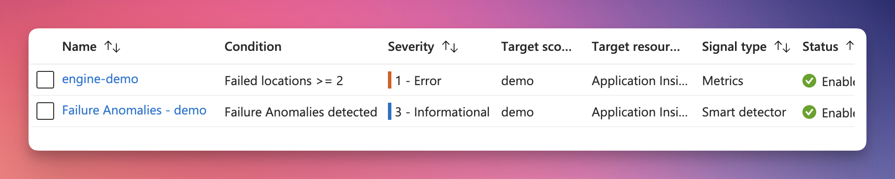
If you click on it. You would see a page like this. You need to change the description field here. This field is what we would receive on our `azure-notifications` channel (which we will create). 

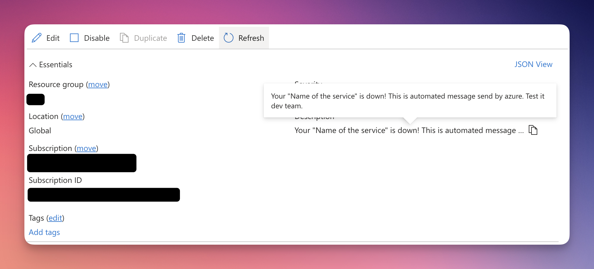

### Step 2: Setting up A new Action Group
Now we want to setup a new `Action Group` so that we can specify a `webhook`. Azure is complicated. You can not set alert rules so that they call a webhook url. You need to create an `Action Group` (which calls the url), and set the action group in alert rule. 

Just Azure stuff. 

Now, create an action group By Clicking the `Action Groups` in `Alerts`. 

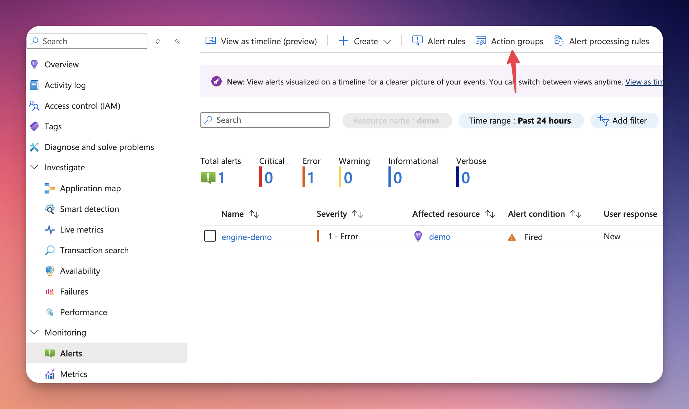

Then, Hit `Create`. Specify an action group name and display name. This is typical. 

The important part is setting a webhook url for this Action Group. Currently, we don't have the url (we will create it in the next part). But for now. I use this site: 

[Webhook.site - Test, transform and automate Web requests and emails](https://webhook.site/)

It will automatically create a url for you. And you can see what is sent to it completely. 

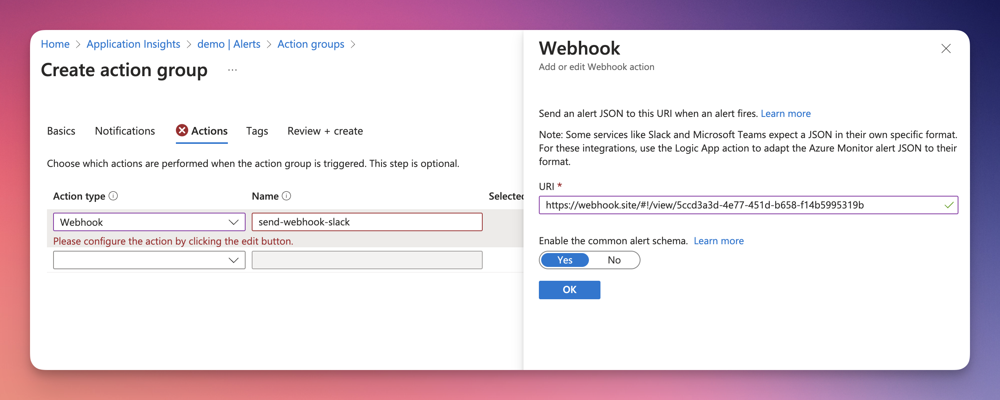

Now hit create and go to the Action Group you created. You can now test it and send a `Log Alert V2` to see how it creates logs. 

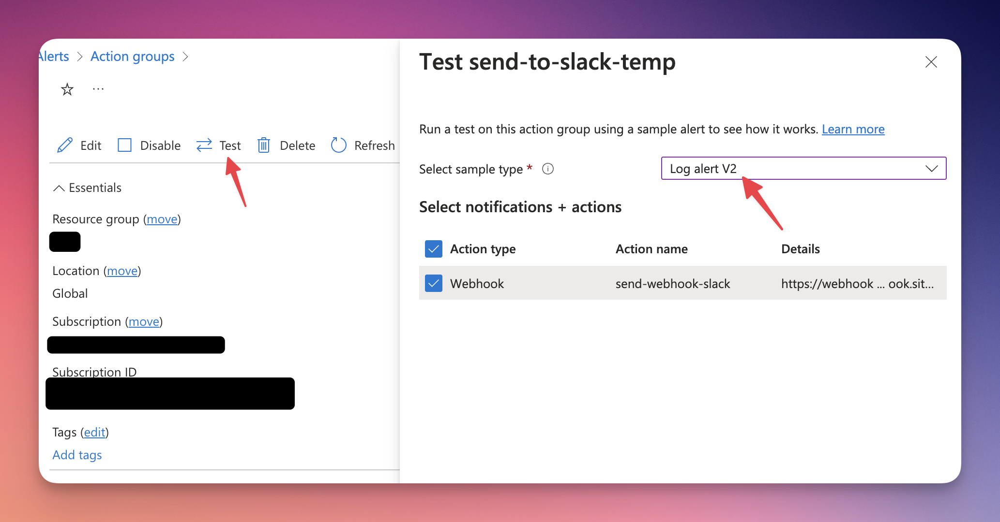

Now, Watch `Webhook.site` for new requests. You will see a post request with a body like this:

```
{
  "schemaId": "azureMonitorCommonAlertSchema",
  "data": {
    "essentials": {
      "alertId": "alert_id",
      "alertRule": "engine-demo",
      "severity": "Sev1",
      "signalType": "Metric",
      "monitorCondition": "Fired",
      "monitoringService": "Platform",
      "alertTargetIDs": [
        "demo"
      ],
      "configurationItems": [
        "demo"
      ],
      "originAlertId": "alert_id",
      "firedDateTime": "2024-06-28T16:09:12.7669824Z",
      "description": "Your \"Name of the service\" is down! This is automated message send by azure. Test it dev team.",
      "essentialsVersion": "1.0",
      "alertContextVersion": "1.0",
      "investigationLink": "link"
    },
    "alertContext": {
      "properties": null,
      "conditionType": "WebtestLocationAvailabilityCriteria",
      "condition": {
        "windowSize": "PT5M",
        "allOf": [
          {
            "metricName": "Failed Location",
            "metricNamespace": null,
            "operator": "GreaterThan",
            "threshold": "2",
            "timeAggregation": "Sum",
            "dimensions": [],
            "metricValue": 5,
            "webTestName": "engine-demo"
          }
        ],
        "windowStartTime": "2024-06-28T16:02:06.601Z",
        "windowEndTime": "2024-06-28T16:07:06.601Z"
      }
    },
    "customProperties": null
  }
}
```
Your message is in `data -> essentials -> description`. 

OK. Now we have the description field. 

We need to do two things:
- We need to create a webhook url to send this description as a message to slack
- We need to set this action group for every `Alert Rule`.

Second one is easy. Just go to your alert rule settings and set it. Don't worry. We can make this automatic in the Step 4. But that's really optional. 

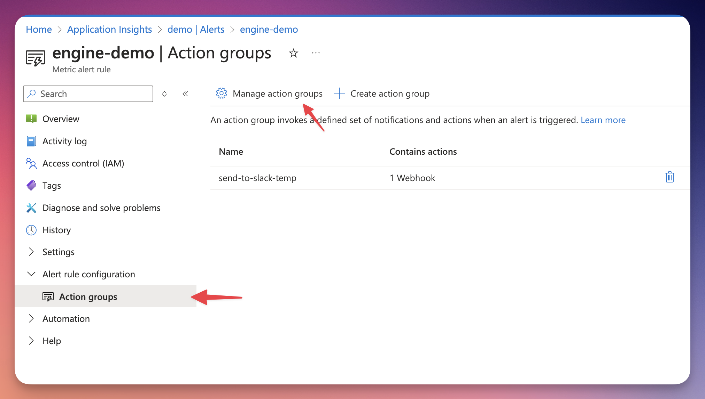
### Step 3: Setting Up Logic App

OK. Until now, we have created a rule which can call a webhook. Now, we just need to create a service which to do two things:
- Provide us with a webhook url
- Process the message and get its description field
- Send the message into slack

I use `Logic App` for this purpose. 

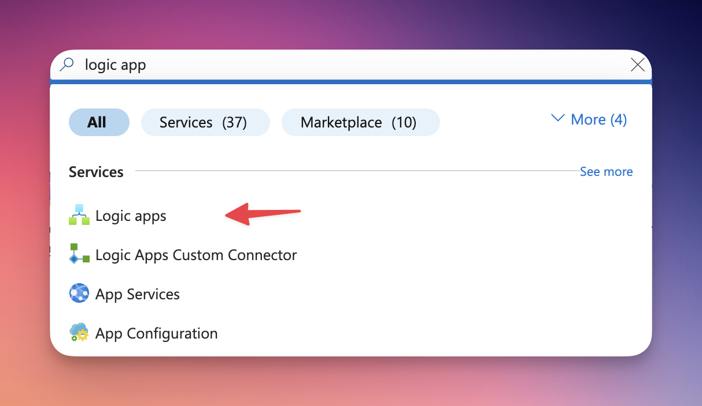

Make sure to select Consumption type Logic App. 
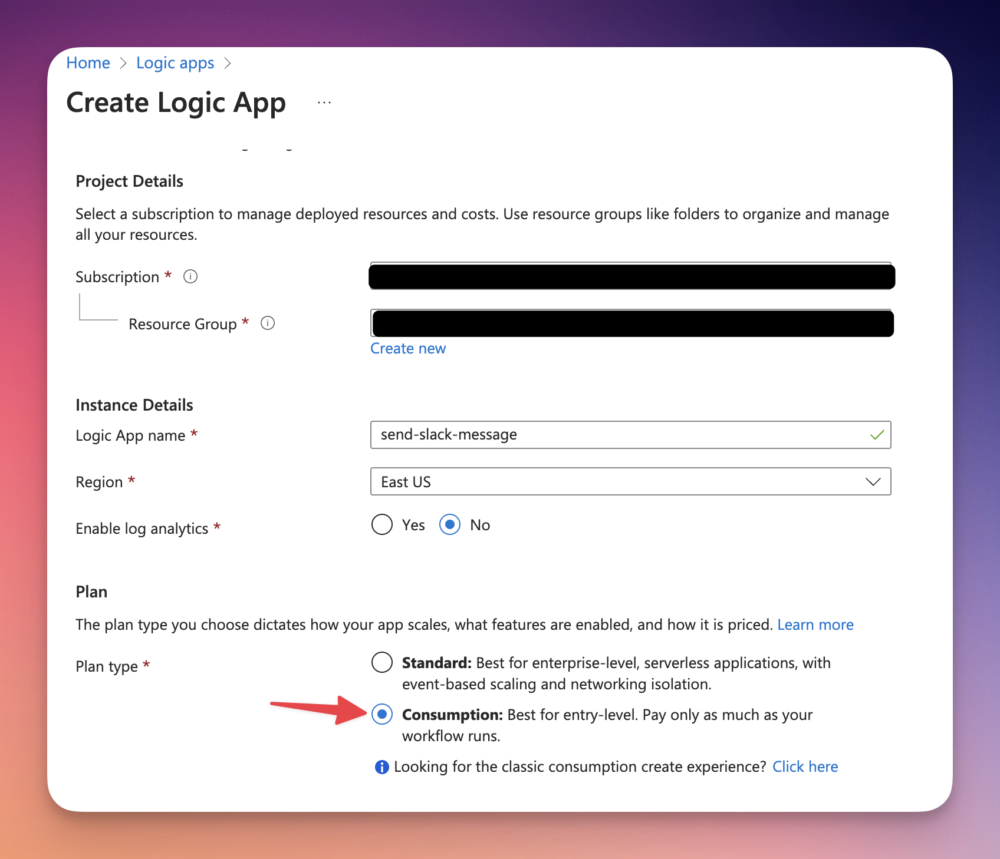

Now go to the logic app you created an under `Developement Tools`, select `Logic App Designer`. Here is where we can design our application. 

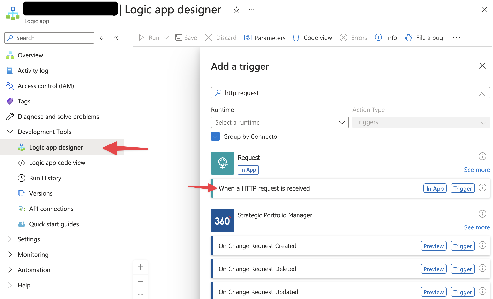

Now, make sure you set the Request Body JSON schema to the JSON items I've you before. 

This is necessary since you want to select description field in the next section. Note that a url would be generated after saving, which you should set in the webhook url from the last section. 

I hope you are not tired. This operation is getting a lot of time! 

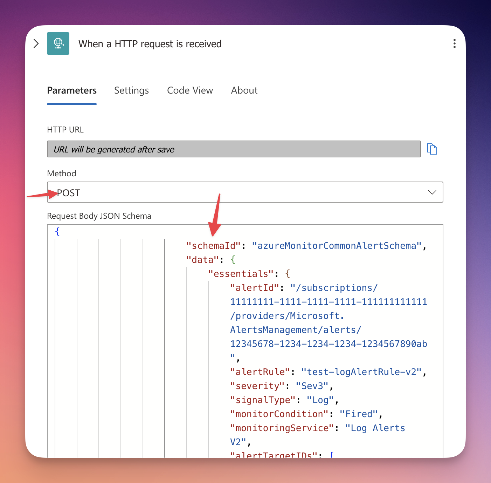

Now, we have the description field. We want to send it into slack. 

We will use a free plugin called `incoming webhook`. Go into your slack apps and find this app and hit `Add to Slack`. 

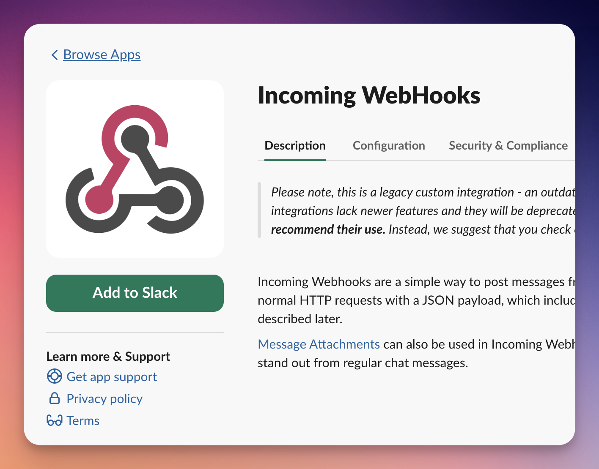
Then you can add it to a channel or create a new channel. Then click on `Add Incoming Webhooks Integration`.

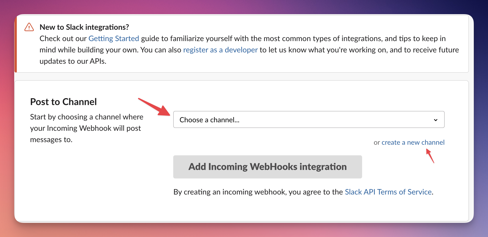

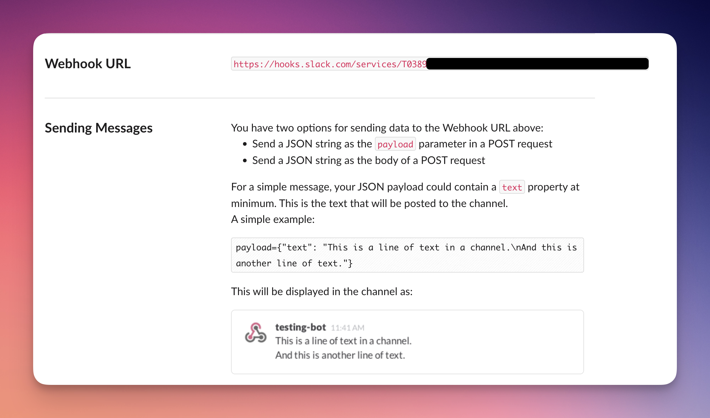
We now have slack webhook url. We can configure it in the `Logic App` easily. 

Just make sure to use body as I've set it. 
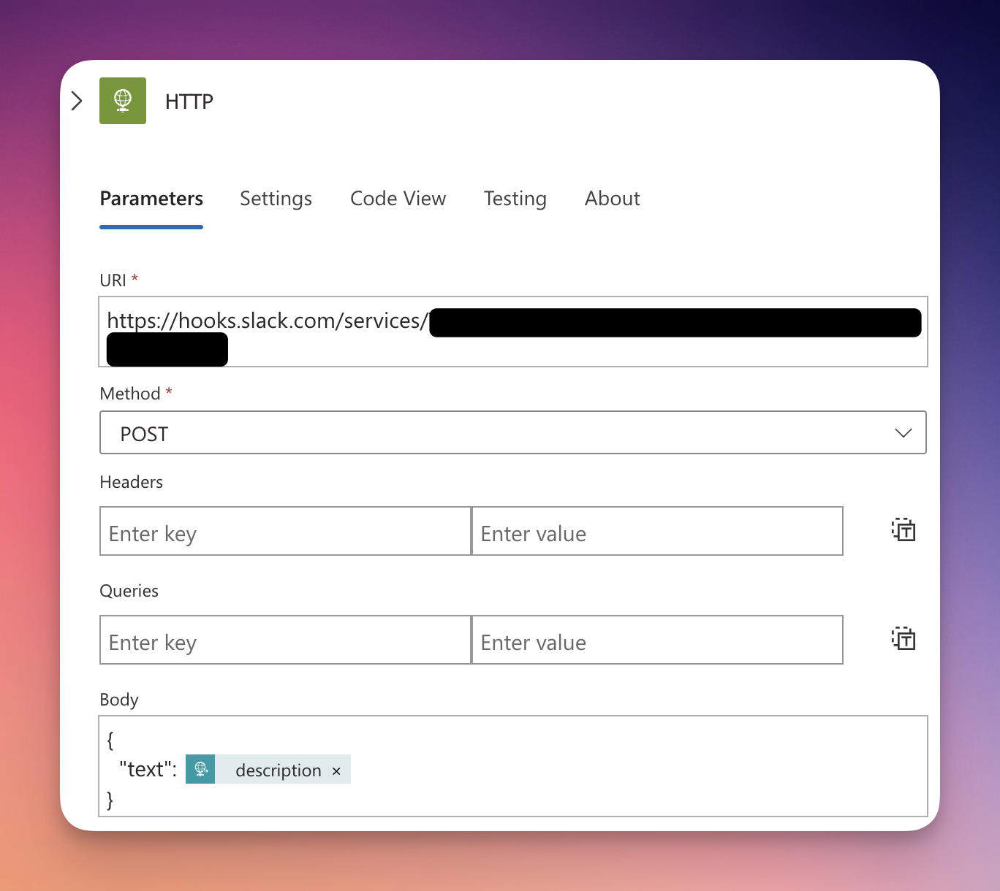

Congratulations! It's finally done! It should've been easier. But once you set it, it would work forever. 
### Step 4 (Optional): Setting up Alert Processing Rule

If you don't want to set `Action Group` for each and every `Alert Rule`, go along with me. 

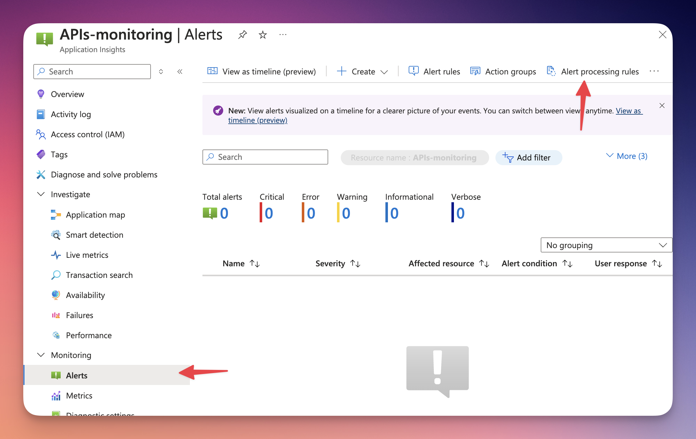

Create an alert processing rule, set the scope to whatever you want (I recommend setting it to `this Application Insight` scope). Then in the rule settings, Apply a specific Action Group. 

This way, all new alert rules would have this Action Group by default. 

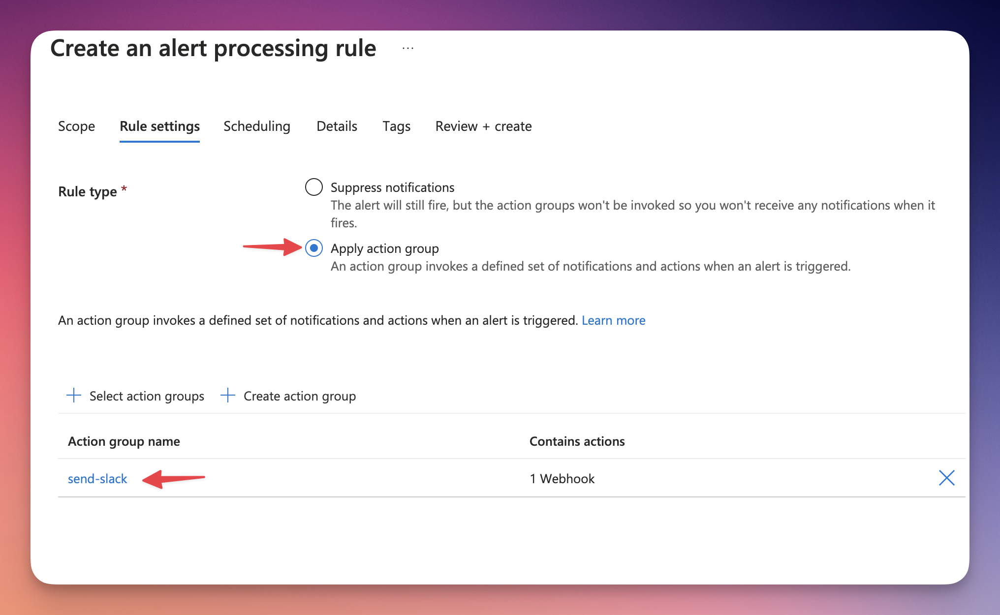

