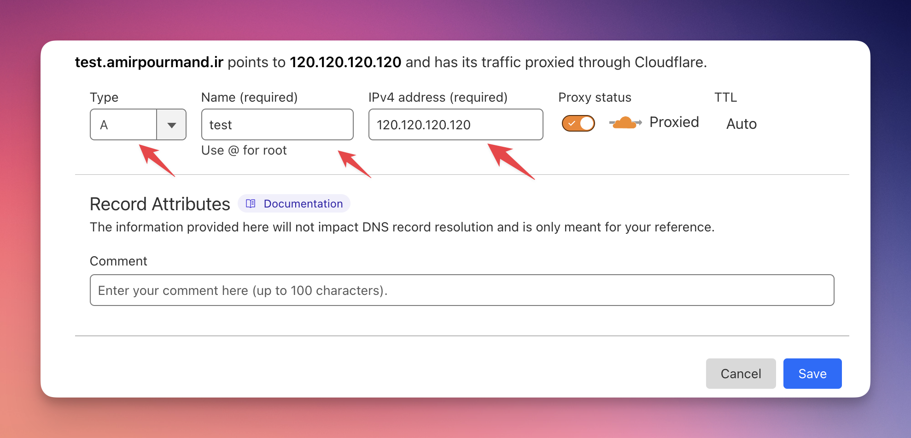
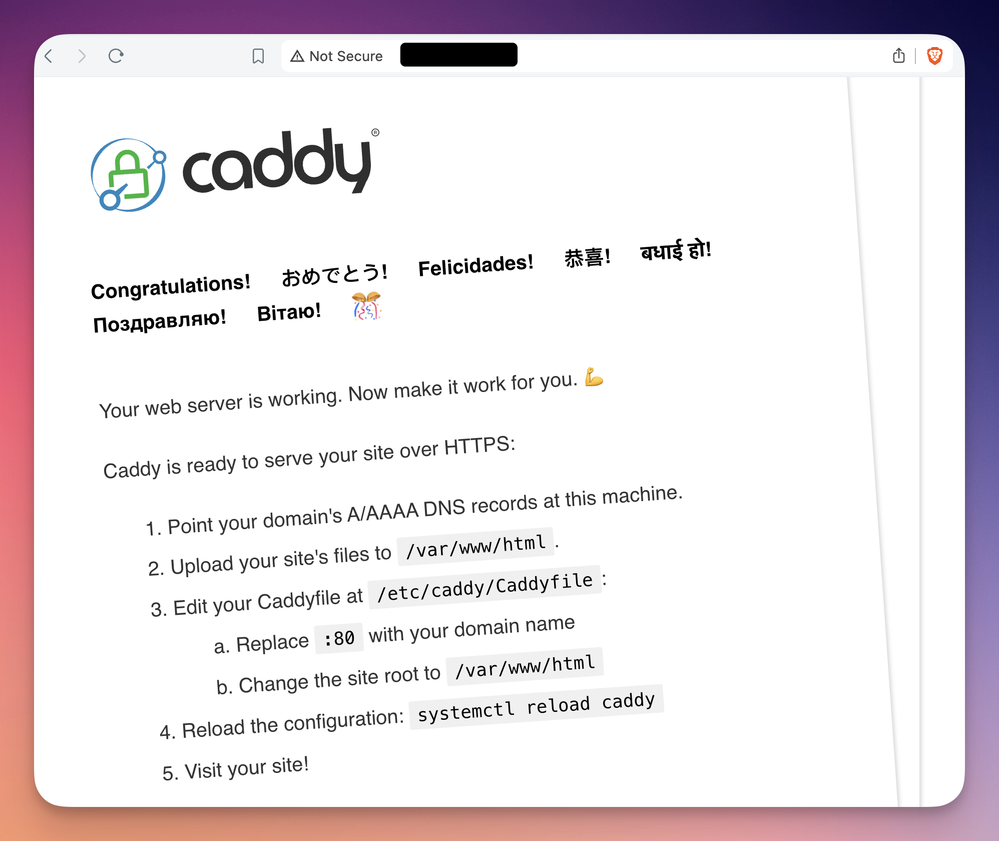

I've recently found Caddy as a tool to assign urls to my docker services and I'm quite happy with it. I've done other reverse proxies like Nginx and Traefik in the past but they are too complicated for my needs. 

Let's start. 

Let's say that you want to assign your url like `newservice.amirpourmand.ir` to a service in a VM with a public IP address. I'll go you through it. 

Also, It has multiple benefits. The first one is that you don't have to do IPs. You don't have to deal with ugly IPs that may change in the future. You deal with Secure URLs. The second is that the connection is `https`. 

### Step 1: Domain Dashboard
First, go to your domain dashboard and set an A record to point your url to an IP address. This is different for each provider. For example, for Cloudflare DNS, you would see something like this:


Just add a subdomain (or full domain) and provide the public IP address of your server. 

To get public IP address, use:
```
curl ipinfo.io
```
### Step 2: Install  Caddy
You can install caddy manually or as a service. I like to install it as a service which is always running on the server itself. 

- [Install — Caddy Documentation](https://caddyserver.com/docs/install)

I suppose you are using ubuntu and layout the config for ubuntu. 

To install:
```bash
sudo apt install -y debian-keyring debian-archive-keyring apt-transport-https curl curl -1sLf 'https://dl.cloudsmith.io/public/caddy/stable/gpg.key' | sudo gpg --dearmor -o /usr/share/keyrings/caddy-stable-archive-keyring.gpg curl -1sLf 'https://dl.cloudsmith.io/public/caddy/stable/debian.deb.txt' | sudo tee /etc/apt/sources.list.d/caddy-stable.list sudo apt update sudo apt install caddy
```

Then, run `sudo systemctl restart caddy` and type your IP in the browser, you should see something like this:

### Step 3: Configure Caddy
The Documentation is simple enough to install but not quite simple to configure it. 

Configuring Caddy is dead simple! Suppose that you have a docker container or any other service on `localhost:8000`. You can easily get it up and running by simply changing a simple file.

For that, run to `sudo nano /etc/Caddy/Caddyfile` and go to the end and add something like this:

```
test.amirpourmand.ir {
	reverse_proxy localhost:8000
}
```


That's it! Restart Caddy via `sudo systemctl restart caddy` and you should see your url which points to this service. It is also https by default. 

Wasn't that simple? 

You can now start configuring it more. And also add more sections to this config file. 

But I can't think about anything more simple to get me to the point where I am. I normally have multiple docker containers which I need to expose to the internet via some URL and this is the way I do it! 

Note that you can restart caddy by both of these commands:
```
sudo systemctl reload caddy
sudo systemctl restart caddy
```

Note2: Don't forget to open port 80 and 443 on your VM. Most likely it is blocked by your VM service provider and you should allow that. (You don't have to allow internal ports like 8000 in this example. Caddy internally routes external requests to these ports).

### References
What I've learned is related to this video and my own research about it. 
- [Self Host 101 - Run Multiple Apps with Caddy | DNS, Static Sites, Reverse Proxies and Let's Encrypt - YouTube](https://www.youtube.com/watch?v=mLznVlBAtcg)