There are lots of tutorials on the internet on how to install a GPU driver on Linux. However, I end up searching again every time I want to install a GPU drivers and I get frustrated when there are multiple ways of doing the same thing and I don't know which one is the best. 

Also, there are some things I've learned which I'd like to share it. 

I've tested this on 3090 GPU and Ubuntu 22.04. Yours may vary a little but the procedure it the same. 

## Before Installation
First, Install `build-essentials` if you don't have it:
```
sudo apt install build-essential
```

(Optional) Then, sometimes you have to update `gcc` to the latest version (default is 11). Otherwise, you may get errors like this one:

```
unrecognized command-line option -ftrivial-auto-var-init=zero
```

In order to update GCC compiler, you just need to run these two commands ([Reference](https://askubuntu.com/questions/1500017/ubuntu-22-04-default-gcc-version-does-not-match-version-that-built-latest-default)):
```bash
sudo apt install --reinstall gcc-12
sudo ln -s -f /usr/bin/gcc-12 /usr/bin/gcc
```
You can check the installation using `gcc --version`:
```
gcc (Ubuntu 12.3.0-1ubuntu1~22.04) 12.3.0
Copyright (C) 2022 Free Software Foundation, Inc.
```

You should also install these two packages in case you don't have them:
```
sudo apt install pkg-config libglvnd-dev
```
In case you don't install you would get this warning when installing the driver ([Reference](https://realtechtalk.com/WARNING_Unable_to_determine_the_path_to_install_the_libglvnd_EGL_vendor_library_config_files_Check_that_you_have_pkgconfig_and_the_libglvnd_development_libraries_installed_or_specify_a_path_with_glvndeglconfigpath_Linux_Ubuntu_Mint_Debian_E-2415-articles)):
```
WARNING: Unable to determine the path to install the libglvnd EGL vendor library config files. Check that you have pkg-config and the libglvnd development libraries installed, or specify a path with --glvnd-egl-config-path.
```

I would also install `vulkan` package to remove the warning which says:
```
 WARNING: This NVIDIA driver package includes Vulkan components, but no Vulkan ICD loader was detected on this system. The NVIDIA Vulkan ICD will not function without the loader. Most distributions package the Vulkan loader; try installing the "vulkan-loader", "vulkan-icd-loader", or "libvulkan1" package.
```
The command to install `vulkan` is ([Reference](https://docs.heavy.ai/installation-and-configuration/installation/installing-on-ubuntu/install-nvidia-drivers-and-vulkan-on-ubuntu)):
```
sudo apt install libvulkan1
```

## Downloading and installing the driver
You should now download the NVIDIA driver from [here](https://www.nvidia.com/download/index.aspx). In my experience, normally the latest and greatest version of NVIDIA would be found there. 

There are also some ways to install NVIDIA drivers using package managers like apt. But personally, I find this way better and more reliable. Also, some drivers have more up-to-date versions on Official NVIDIA site. 

For example, at the time of writing this article, NVIDIA driver version 550 is not available on apt. But, it is easily downloadable via NVIDIA Official website. 

To see your GPU information use ([Reference](https://askubuntu.com/questions/5417/how-to-get-the-gpu-info)):
```
sudo lshw -C display
```
Then, you will get an output like this:
```
  *-display
       description: VGA compatible controller
       product: GA102 [GeForce RTX 3090]
       vendor: NVIDIA Corporation
       physical id: 0
       bus info: pci@0000:04:00.0
       version: a1
       width: 64 bits
       clock: 33MHz
```
or 
```
lspci | grep -i nvidia
```
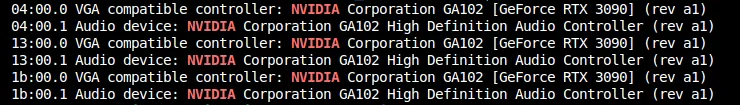

It shows that I am using RTX 3090. Then, I would choose the operating system as `linux 64-bit` and download type as `production branch`. It would show something like [this page](https://www.nvidia.com/Download/driverResults.aspx/218826/en-us/).
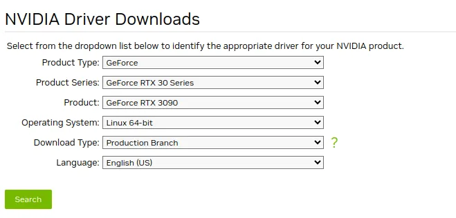
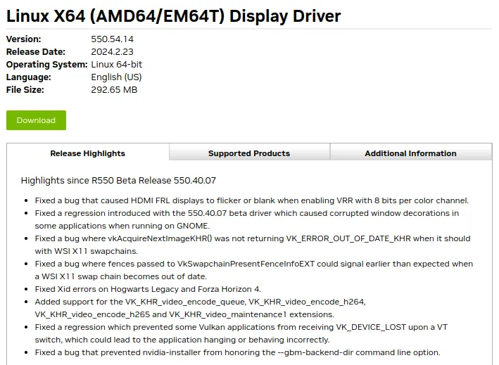

Then you download a `.run` file. Change the permission and run the file as root:
```
chmod +x NVIDIA-Linux-x86_64-550.54.14.run
sudo ./NVIDIA-Linux-x86_64-550.54.14.run
```

Note that you can start downloading in your browser, and then copy the link into VM machine that you have and `wget link` to download it inside VM. 

This should normally work and do the job for you. I would say yes on everything it would say afterwards. 
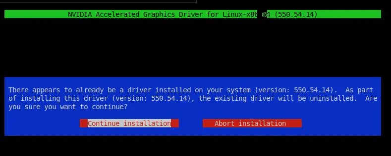
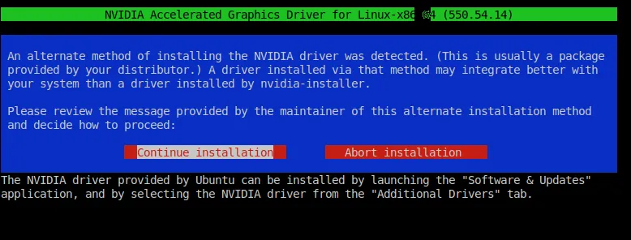
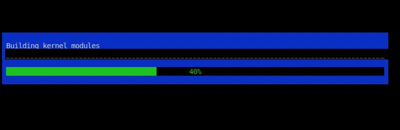
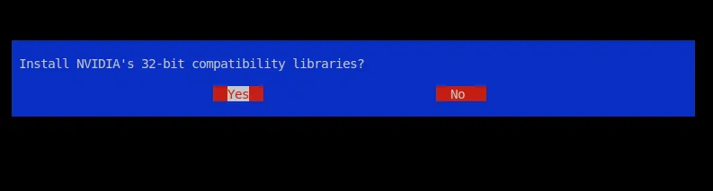
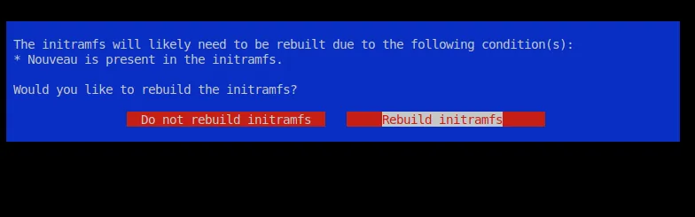
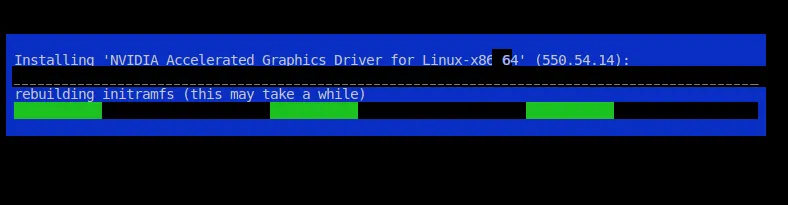
Make sure to hit yes on this screen (default is no):
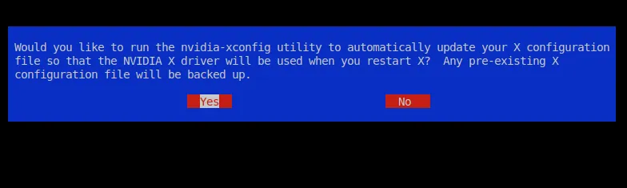
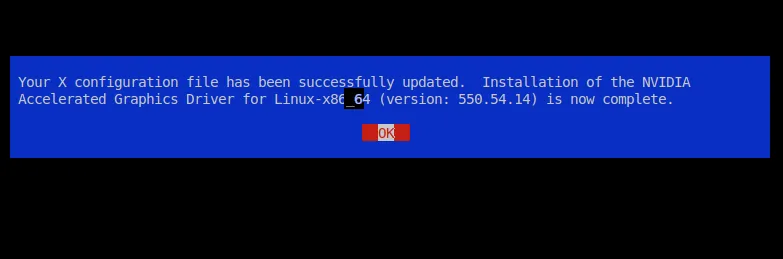

If successful, you should see something like this when running `nvidia-smi`:
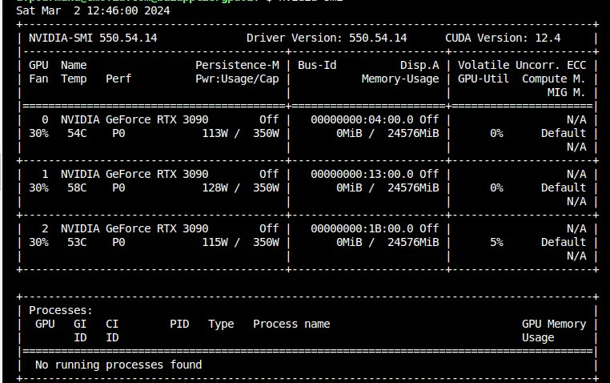
## Blacklist Nouveau (when using VMWare ESXI)
Sometimes, you may be working on a virtual machine that is hosted on VMware ESXi. In that case, you may get errors like this after using `nvidia-smi`:
```
no-devices-were-found
```

To solve it, you should also do the following ([Reference](https://forums.developer.nvidia.com/t/nvidia-smi-no-devices-were-found-vmware-esxi-ubuntu-server-20-04-03-with-rtx3070/202904/39)).

```
mkdir -p /etc/modprobe.d/
echo 'blacklist nouveau' | sudo tee /etc/modprobe.d/blacklist-nvidia-nouveau.conf
echo 'options nouveau modeset=0' | sudo tee -a /etc/modprobe.d/blacklist-nvidia-nouveau.conf
echo 'options nvidia NVreg_OpenRmEnableUnsupportedGpus=1' | sudo tee /etc/modprobe.d/nvidia.conf
```
Then update the kernel init using:
```
sudo update-initramfs -u
```
and reboot the server: 
```
sudo reboot
```
After that you should install your driver using:
```
sudo ./NVIDIA-Linux-x86_64-550.54.14.run -m=kernel-open
```
Note that `-m=kernel-open` is important. Otherwise, it wouldn't work. 

Reboot the server afterwards and you are good to go. 
## Debugging
Debugging NVIDIA installation is a hard task. Here's how to make it easier. 

In case you have problem during installation, two commands help:

```
less /var/log/nvidia-installer.log
```
NVIDIA installer won't show any detail in case there is an error. You should use the log file to see the issues. 

```
sudo nvidia-bug-report.sh
less nvidia-bug-report.log.gz
```

Also, `dmesg` would help (make sure to run it after `nvidia-smi` to see more information on why it is having problem):
```
sudo dmesg
```

## Installing CUDA Toolkit
After installing GPU, you might need to install CUDA on the server. Make sure to read this tutorial and go along with it. 

[NVIDIA CUDA Installation Guide for Linux](https://docs.nvidia.com/cuda/cuda-installation-guide-linux/index.html)

However, personally, I wouldn't install that since I use Docker. I normally use docker base images which have CUDA inside them. But if you want to run code on bare metal, you can install CUDA.

> NVIDIA says: you do not need to install the CUDA Toolkit on the host system, but the NVIDIA driver needs to be installed. [GitHub - NVIDIA/nvidia-container-toolkit: Build and run containers leveraging NVIDIA GPUs](https://github.com/NVIDIA/nvidia-container-toolkit)

## Add GPU Support For Docker
First, you have to install docker using [this guide](https://docs.docker.com/engine/install/ubuntu/) (in case you don't have it already).

Then, I would use [this tutorial](https://docs.nvidia.com/datacenter/cloud-native/container-toolkit/latest/install-guide.html) to give GPU access to docker daemon. 

In short, first add NVIDIA repositories to apt:
```bash
curl -fsSL https://nvidia.github.io/libnvidia-container/gpgkey | sudo gpg --dearmor -o /usr/share/keyrings/nvidia-container-toolkit-keyring.gpg \
  && curl -s -L https://nvidia.github.io/libnvidia-container/stable/deb/nvidia-container-toolkit.list | \
    sed 's#deb https://#deb [signed-by=/usr/share/keyrings/nvidia-container-toolkit-keyring.gpg] https://#g' | \
    sudo tee /etc/apt/sources.list.d/nvidia-container-toolkit.list
```

Then install `nvidia-container-toolkit`:
```bash
sudo apt-get update
sudo apt-get install -y nvidia-container-toolkit
```

After that, you need to update `daemon.json` using:
```bash
sudo nvidia-ctk runtime configure --runtime=docker
sudo systemctl restart docker
```

```bash
cat /etc/docker/daemon.json
```
Output:
```
{
    "runtimes": {
        "nvidia": {
            "args": [],
            "path": "nvidia-container-runtime"
        }
    }
```

You should now be able to run: 
```
docker run --gpus all nvidia/cuda:11.7.1-cudnn8-devel-ubuntu22.04 nvidia-smi
```
The output should be the same as running `nvidia-smi` on bare-metal (outside docker).

Note that you don't need to do this on Azure VM Servers. There are pre-build images which have NVIDIA driver installed and you can also use either HPC images or DSVM images from the marketplace.
## References
- [Ubuntu 22.04 default GCC version does not match version that built latest default kernel - Ask Ubuntu](https://askubuntu.com/questions/1500017/ubuntu-22-04-default-gcc-version-does-not-match-version-that-built-latest-default)
- [Nvidia-smi "No devices were found" - VMWare ESXI Ubuntu Server 20.04.03 with RTX3070 - Graphics / Linux / Linux - NVIDIA Developer Forums](https://forums.developer.nvidia.com/t/nvidia-smi-no-devices-were-found-vmware-esxi-ubuntu-server-20-04-03-with-rtx3070/202904/38)
- [NVIDIA Driver Downloads](https://www.nvidia.com/Download/index.aspx)
- [How to Use GPUs from a Docker Container | Saturn Cloud Blog](https://saturncloud.io/blog/how-to-use-gpu-from-a-docker-container-a-guide-for-data-scientists-and-software-engineers/)
- [NVIDIA Container Toolkit Installation Guide](https://docs.nvidia.com/datacenter/cloud-native/container-toolkit/1.8.0/install-guide.html)
