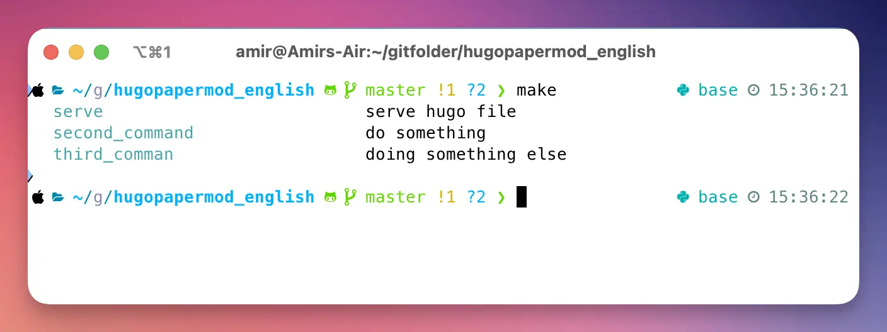

Makefiles are one of the most useful tools I've been working with. I can say that it can be useful for lots of projects (with any language).

### What is Makefile?

Makefiles are essentially a place where you can store your most frequently used commands in one place. They make repetitive tasks easier by creating short commands. 

Let's take a look at sample file:

```yaml
install_packages:
	pip install -r requirements.txt

generate_deps:
	pip-compile requirements.in -o requirements.txt

docs:
    pdoc --html --force --output-dir docs common
```

The way to execute this **targets** would be using `make generate_deps `or `make docs`. By default make command will search for a file named `Makefile` (with no extension) to run your commands. 

The commands here would really depend on your project at hand. The good thing, is that you can find them at every project. 

### Real Makefile Usecase
Previously, I used to train object detection models to detect something. Let's look at a more real use case of Makefile:

```yaml
update: ## pull git updates
	git pull

tensorboard: ## run tensorboard
	tensorboard --logdir runs/train --port 6006

workers = 1
device = 0
batch = 30

train_yolov5m: ## yolov5m without 3dim data
	git checkout sampler
	git pull
	python train.py \
		--img-size 512 \
		--weights /data/weights/last.pt \
		--data /data/database.yaml \
		--hyp /data/hyps/hyp_normal_yolov5m.yaml \
		--epochs 200 --batch-size 60 \
		--device $(device) --save-period 5 \
		--workers $(workers)

train_yolov5m3d_midlabel: ## train yolov5 middle-sized mode
	git checkout sampler_aneurysm
	git pull
	python train.py \
		--img-size 1024 \
		--weights /data/weights/last.pt \
		--data /data/database.yaml \
		--hyp /data/hyps/hyp-3d_yolov5m.yaml \
		--epochs 200 --batch-size 20 \
		--device $(device) --save-period 5 \
		--workers $(workers)

version=last
val_yolov5s_midlabel: ##validate yolov5s_midlabel
	git checkout sampler_aneurysm
	git pull
	python val.py \
		--weights /data/weights/$(version)$.pt \
		--data /data/database.yaml \
		--batch-size $(batch) --device $(device)\
		--img-size 512 --task $(task) \
		--save-txt --workers $(workers)
```

Seriously. Who on their right mind would like to run commands like this? And It might get more complicated as time goes! 

If I don't do that, I should **remember** that every time I need to switch git branch and provide the necessary arguments for train module and what not. You can see that It reduces a lot of pain.

### Use of Variables in Makefiles
You may have seen that I've used variables in my Makefile. It is actually a very common way to make it more flexible. 

To define them, you can just write them in yaml file:
```yaml
first_variable=value1
second_variable=value2
```

Let's see a simplified usecase:
```yaml
port=1313
serve: ## serve hugo file
	rm -rf public/
	hugo serve --port $(port)
```

This way, the default port is 1313. If you want to change it, you can use:
```bash
make server port=1010
```

You may also want to look at the `Real Makefile Usecase` above to see how I have used variables. 
### Makefile help
Makefiles have one problem. In order to see what commands you can use, you should look inside them.

There is also a solution to this problem:
```yaml
help:
	@egrep -h '\s##\s' $(MAKEFILE_LIST) | awk 'BEGIN {FS = ":.*?## "}; {printf "\033[36m %-30s\033[0m %s\n", $$1, $$2}'

serve: ## serve hugo file
	rm -rf public/
	hugo serve

second_command: ## do something
	echo "I am doing something"

third_comman: ## doing something else
	echo "I am doing something else"
```
Adding this help target helps you see what targets you have inside you Makefile. This way when you type `make`, you would see something like this:


### Things to consider
Each makefile command runs on a completely separate shell. So, it doesn't access anything in your shell. This includes your environment variables you have set or python virtual environment you have activated. 

For example, if you are using Conda to separate your different environments, you have to add this command to every target in makefile. So, it would look like this:

```yaml
SHELL = /bin/bash
CONDA_ACTIVATE = source $$(conda info --base)/etc/profile.d/conda.sh ; conda activate ; conda activate

.PHONY: install
install: ## install yolov5 dependencies
	$(CONDA_ACTIVATE) yolov5
	pip install -r requirements.txt

tensorboard: ## run tensorboard
	$(CONDA_ACTIVATE) yolov5
	tensorboard --logdir runs/train --port 6006
```
Also, don't forget to add `.phony` to you makefile targets ([Why this is the case](https://stackoverflow.com/questions/2145590/what-is-the-purpose-of-phony-in-a-makefile)). It is not necessary most of the time. For example, If you have a file named `install` in the same directory as Makefile above, It wouldn't know which command it should execute. The file or the target! Dummy Makefile! 

Also, here a great point about using Makefiles. I've came across it multiple times. So be aware (
[Reference](https://news.ycombinator.com/item?id=11936703)) 

> The single biggest piece of advice I can give for Make is to make sure your text editor uses real tabs in Makefiles. My personal preference for everything is spaces (mostly a habit learned from Python's PEP 8), but Make doesn't honour spaces for indentation - only tabs.
> 
> Despite being an obvious usability hole, this has never been fixed. Exacerbating the issue is the poor error message given upon encountering a space-indented line in Make:
> 
> ```
>     Makefile:2: *** missing separator.  Stop.
> ```
> 
> Make is ubiquitous and fairly easy to use, but it's warts like this that remind you that it is fundamentally a build system from the _far_ past.

### Starting Point
In fact whenever I want to start a new `Makefile`, I just copy these stuff and start from here:

```yaml
.ONESHELL:
SHELL = /bin/bash
  
.PHONY: help
help:
	@egrep -h '\s##\s' $(MAKEFILE_LIST) | awk 'BEGIN {FS = ":.*?## "}; {printf "\033[36m %-30s\033[0m %s\n", $$1, $$2}'

.PHONY: first_command
first_command: ## documentation of first_command
	echo "OK Guys"
```

Good Luck! 
### References
- [makefiles: the problem](https://calmcode.io/course/makefiles/the-problem): This great tutorial from CalmCode would also showcase this abilities in an intuitive way. 
