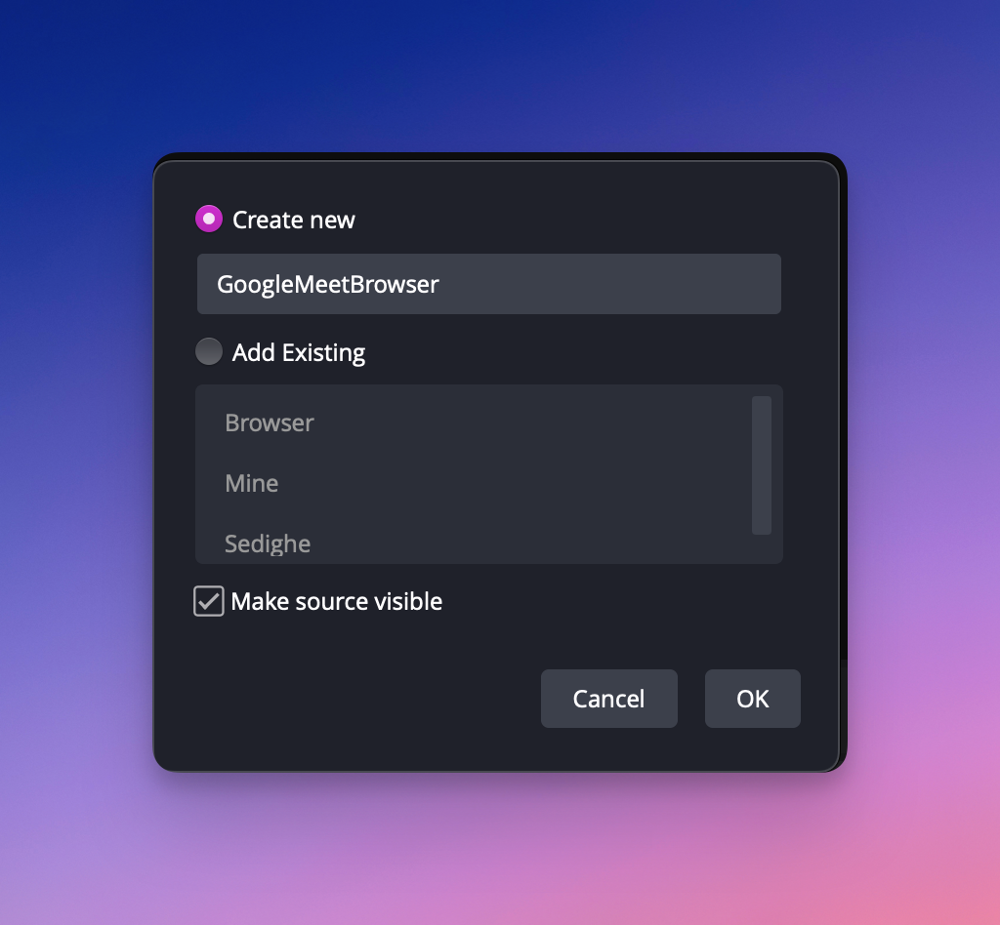
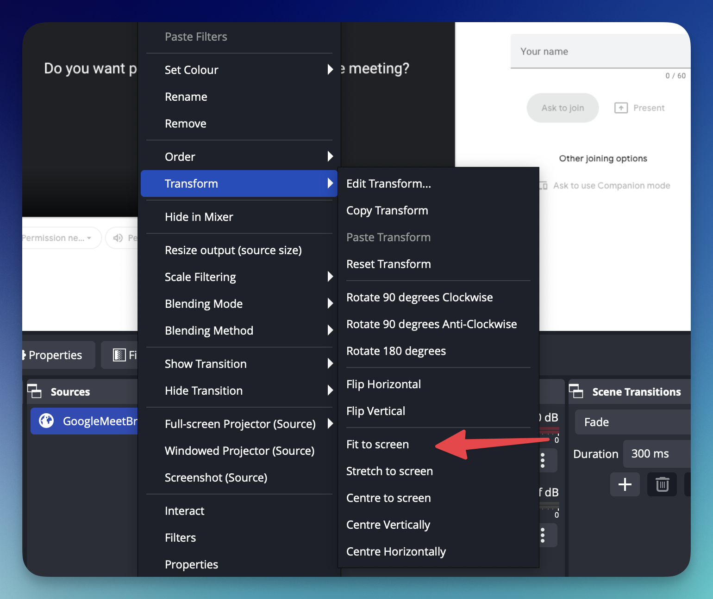
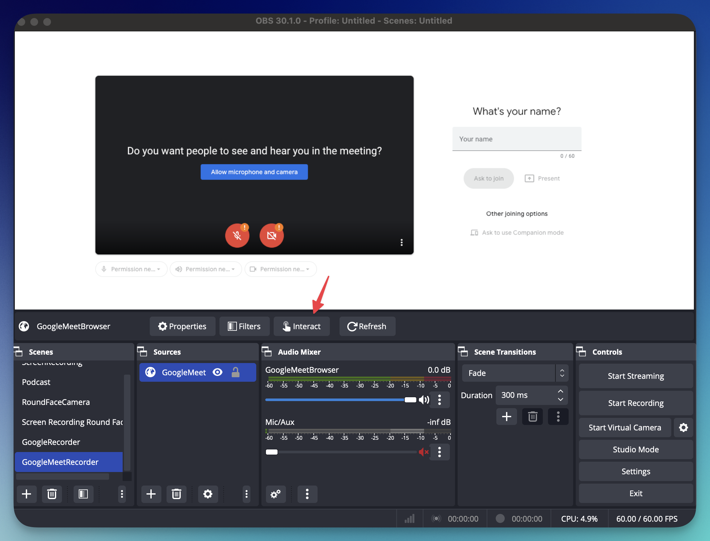
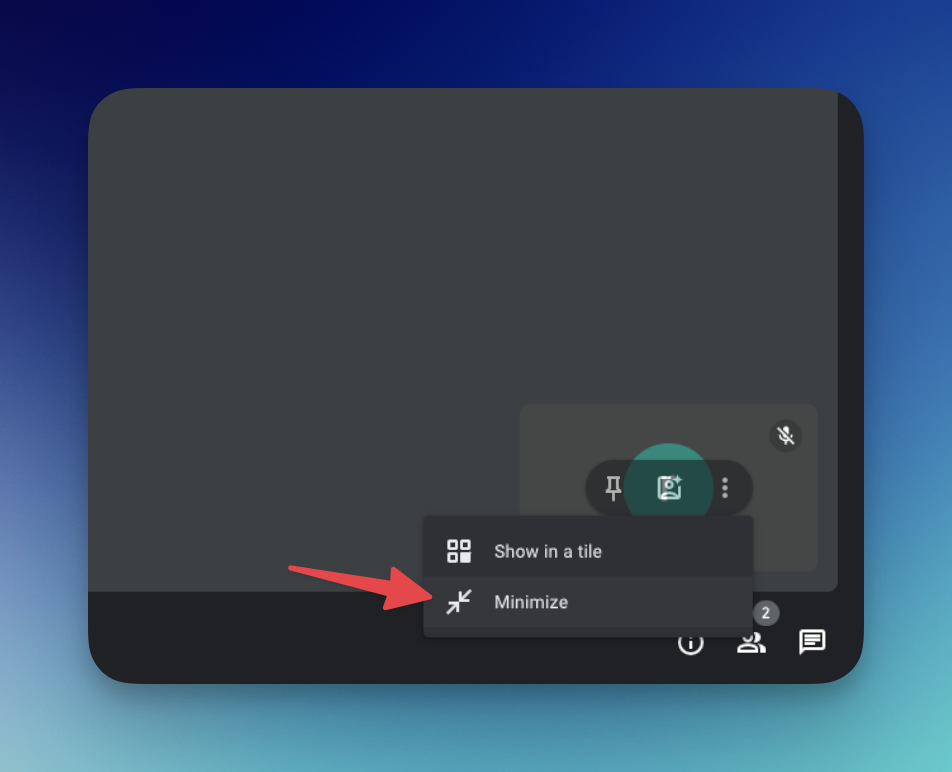

Some days ago, I wanted to record a Google Meet session as a podcast and I didn't want to pay for just recording the call, neither to google nor third party services. 

Here's how you can do it step by step. 

First, install OBS Studio (which is available on all OSes) and open it up. Then click on + Icon to create a new scene. Let's call it `GoogleMeetRecorder`. 

After creating a scene, you can add some `Sources` to the scene.

Now A Window should appear which asks you how to configure the browser in OBS. Here are some notes you should pay attention to:
- Set the URL to the meeting url that you want to record
- Set appropriate width and height (I suggest 1920 by 1080)
- Be Careful to check `Control Audio via OBS`, otherwise, you would have echo and you will hear your voice multiple times.

Then you have to fit the source to the scene. Here's how to do it:

You should now see a window pretty much like this. Make sure to hit `Interact`. Then a window would pop up. That's pretty much your browser and you can enter your name (something like Recorder) and ask to join the meeting. 

Once, you are accepted as a guest make sure you minimize yourself so that only people in the meeting are shown. 

You are pretty much done. Make sure your Audio Mixer Setting is set like me and you are done. 

The reason for this setting is that the voice should be only recorder through OBS internal Browser. Here, If you don't disable your Microphone, you would also hear your voice twice in the recording (with some lag because of the internet). You don't want that. Right?

Now, you can `Start Recording`. Also, Don't forget to mute all your notifications. 

I hope this is an easy to do tutorial for you. 