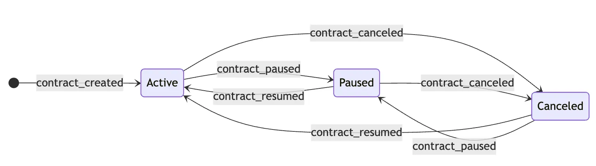
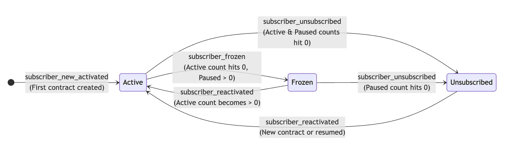

### The Problem
This was one of the challenges I had to handle recently. I wanted to model a Definitive Finite Automata ([DFA](https://en.wikipedia.org/wiki/Deterministic_finite_automaton)) using SQL. This reminded me of one of the courses I took in my bachelors ([+](https://www.geeksforgeeks.org/theory-of-computation/introduction-of-finite-automata/)). This is where I understood how to use DFA for a SQL problem which at first, seems unsolvable. 

Let's define the problem clearly. Note that this is a real-life business problem. I'm not talking about theory and a made-up problem. 

Suppose that we have a table where we store contract events for each store. Customers can create, pause, resume or cancel their contracts. 

So each contract has three states:
- Active
- Paused
- Canceled

And these are the transitions between states via events: 



I had a corresponding table as well for these state changes. Let's call it `contract_events`. 

So, this would be our table. Let's name it `contract_events` as it captures events per shop, per customer and per contract. 

| **shop_id** | **customer_id** | **contract_id** | **event_date** | **event**         |
| ----------- | --------------- | --------------- | -------------- | ----------------- |
| 101         | 55501           | **C1**          | 2024-01-01     | contract_created  |
| 101         | 55501           | **C1**          | 2024-01-15     | contract_paused   |
| 101         | 55501           | **C2**          | 2024-01-20     | contract_created  |
| 101         | 55501           | **C1**          | 2024-02-01     | contract_resumed  |
| 101         | 55501           | **C1**          | 2024-02-01     | contract_resumed  |
| 101         | 55501           | **C1**          | 2024-03-01     | contract_canceled |
| 101         | 55501           | **C2**          | 2024-03-10     | contract_canceled |
| 102         | 99902           | **C3**          | 2024-01-05     | contract_created  |
| 102         | 99902           | **C3**          | 2024-01-10     | contract_resumed  |
| 102         | 99902           | **C3**          | 2024-02-15     | contract_paused   |
| 102         | 99902           | **C3**          | 2024-03-10     | contract_paused   |
| 102         | 99902           | **C3**          | 2024-03-20     | contract_canceled |

 Each shop has multiple customers and each of the customers may create multiple contracts. So, there are one-to-many relationships so far. 

What do we needed?

Basically, we wanted to look at events table from **subscriber point of view**. Not at contract level. But at subscriber level. 

Why? Because we wanted to count active subscribers. We wanted to be able to calculate churn subscriber or see how many new subscribers used the app at specific duration. 

Also, we wanted to have those events stored in an actual database so that we can track, watch and monitor them. We wanted to write automated tests as well. Also, having physical tables can make the debug process much easier. 

This is because sometimes our user doesn't care about how many contract he has. He want to know how many people use his system. They would even if one of them has one contract and the other has 10 active contracts. 

So, we had to model subscriber entity (instead of contract).

Each subscriber has also three states:
- Active (If they have at least one active contract)
- Frozen (if they have paused all of their contracts)
- Unsubscribed (if they have canceled all of their contracts)



Also, we also want to mark new active customers differently from old active customers using `subscriber_new_activated` and `subscriber_reactivated` events.

This is very useful if we want to see how many `new customers` we have in a given period. 

In essence, we wanted to create a subscriber events table which outputs events like this:

| **shop_id** | **customer_id** | **event_date** | **event**                    | **Logic Explanation**                               |
| ----------- | --------------- | -------------- | ---------------------------- | --------------------------------------------------- |
| 101         | 55501           | 2024-01-01     | **subscriber_new_activated** | First activation.                                   |
| 101         | 55501           | 2024-01-15     | **subscriber_frozen**        | Active count hits 0 (C1 paused).                    |
| 101         | 55501           | 2024-01-20     | **subscriber_reactivated**   | Becomes active via C2 while C1 still frozen.        |
| _skip_      | 55501           | 2024-02-01     | _no row_                     | C1 resumes. Active count 1 -> 2. Still 'activated'. |
| _skip_      | 55501           | 2024-03-01     | _no row_                     | C1 cancels. Active count 2 -> 1. Still 'activated'. |
| 101         | 55501           | 2024-03-10     | **subscriber_unsubscribed**  | Last active contract (C2) cancels.                  |
| 102         | 99902           | 2024-01-05     | **subscriber_new_activated** | First activation.                                   |
| 102         | 99902           | 2024-02-15     | **subscriber_frozen**        | Moves from active to frozen.                        |
| 102         | 99902           | 2024-03-20     | **subscriber_unsubscribed**  | Final churn.                                        |

Now the problem seems well-defined. You can now think about how to get to `subscribers_events` table. 

### First Solution
My First solution was to simply keep a **counter** per event. 

For example: In active state, we can say that `created` or `resume` event have +1 impact. and `pause` or `cancel` have -1 impact. (We can do this for any other state as well). We may as well increase the numbers of counters to whatever we want (it won't make fundamental difference).

The code would be written as below. 
```sql
WITH event_weights  
     AS (SELECT shop_id,  
                customer_id,  
                contract_id,  
                event_date,  
                event,  
                CASE  
         WHEN event IN ( 'contract_created', 'contract_resumed' ) THEN  1  
         WHEN event IN ( 'contract_paused', 'contract_canceled' ) THEN  -1  
                  ELSE 0  
                END AS active_weight
         FROM   contract_events),  
     running_totals  
     AS (SELECT *,  
                SUM(active_weight)  
                  over (  
                    PARTITION BY shop_id, customer_id  
                    ORDER BY event_date ROWS BETWEEN unbounded preceding AND  
                  CURRENT ROW ) AS  
                current_active_count
         FROM   event_weights)  
SELECT *  
FROM   running_totals;
```

I thought about these kinds of solutions a lot. Modifying counters via different case statements won't work. This can not be a solution since the contract can have many many flows. 

It can go between paused and canceled event indefinitely and the current active count would be negative! Also, the data isn't perfect. Sometimes, we may have two create events at the same time for the same contract (one is redundant). In rare cases, we would have resume event after create event. 

This is real data that we are talking about. Maybe there was a batch operation and the user does that. We can not blame him. But we should write the code so that in handles every scenario. Every scenario that a DFA supports. 

How can we count how many active, paused and cancelled contract we have chronologically (at any given time)?

Think about this. How would you handle this? In general, how can you model any DFA using SQL? 
### My Solution
If you think about the problem a little, you would soon understand that we need to somehow record the **previous state** in order to understand what impact our action has. 

We can't simply count contract events. 

The idea here is that for each event, we have to have its previous event. This can be done using a simple **lag** operation over contract_id (and shop_id for safety).

Then, we can calculate the **Impact** by aggregating the **Inflow** (entries) and subtracting the **Outflow** (exits) for each specific state. This is how we can correctly know the total count of each state at any given time. 

For example for `Active state` this would be our state machine. 

| **Previous Event**  | **Current Event**   | **Logic**                                    | **Active Impact** |
| ------------------- | ------------------- | -------------------------------------------- | ----------------- |
| `NULL`              | `contract_created`  | **Entry:** Starts lifecycle as active.       | **+1**            |
| `contract_paused`   | `contract_resumed`  | **Entry:** Returning to active from frozen.  | **+1**            |
| `contract_canceled` | `contract_resumed`  | **Entry:** Returning to active from churned. | **+1**            |
| `contract_created`  | `contract_paused`   | **Exit:** Moving to frozen.                  | **-1**            |
| `contract_resumed`  | `contract_paused`   | **Exit:** Moving to frozen.                  | **-1**            |
| `contract_created`  | `contract_canceled` | **Exit:** Moving to churned.                 | **-1**            |
| `contract_resumed`  | `contract_canceled` | **Exit:** Moving to churned.                 | **-1**            |
| `Same as Current`   | `Any`               | **Stutter:** Redundant event; ignored.       | **0**             |
For paused state:

| **Previous Event**  | **Current Event**   | **Logic**                                            | **Paused Impact** |
| ------------------- | ------------------- | ---------------------------------------------------- | ----------------- |
| `contract_created`  | `contract_paused`   | **Entry:** Active contract is put on hold.           | **+1**            |
| `contract_resumed`  | `contract_paused`   | **Entry:** Active contract is put on hold.           | **+1**            |
| `contract_canceled` | `contract_paused`   | **Entry:** Re-activating a churned user into frozen. | **+1**            |
| `contract_paused`   | `contract_resumed`  | **Exit:** Moving back to active.                     | **-1**            |
| `contract_paused`   | `contract_canceled` | **Exit:** Moving from frozen to churned.             | **-1**            |
| `NULL`              | `contract_created`  | **Neutral:** Created contracts skip this bucket.     | **0**             |

We can write similar state machines for canceled state. (But I won't waste your time). 

Then we convert these transition tables to simple case statements in SQL. 

```sql
WITH distinct_contract_events
     AS (SELECT DISTINCT shop_id,
                         shop_currency,
                         shopify_domain,
                         customer_id,
                         contract_id,
                         event_date,
                         event
         FROM   contract_events
         GROUP  BY shop_id,
                   shop_currency,
                   shopify_domain,
                   customer_id,
                   contract_id,
                   event_date,
                   event),
     previous_events
     AS (SELECT DISTINCT shop_id,
                         shop_currency,
                         shopify_domain,
                         customer_id,
                         contract_id,
                         event_date,
                         event,
                         Row_number()
                           OVER (
                             partition BY shop_id, contract_id
                             ORDER BY event_date ) AS event_row_number,
                         Lag(event)
                           OVER (
                             partition BY shop_id, contract_id
                             ORDER BY event_date ) AS previous_event,
         FROM   distinct_contract_events)
SELECT shop_id,
       shop_currency,
       shopify_domain,
       customer_id,
       contract_id,
       event_date,
       event_row_number,
       event,
       previous_event,
       CASE
         WHEN event = previous_event THEN 0
         WHEN event = 'contract_resumed'
              AND previous_event = 'contract_created' THEN 0
         WHEN event IN ( 'contract_created', 'contract_resumed' ) THEN 1
         WHEN previous_event IN ( 'contract_created', 'contract_resumed' ) THEN
         -1
         ELSE 0
       END AS active_impact,
       CASE
         WHEN event = previous_event THEN 0
         WHEN event = 'contract_paused' THEN 1
         WHEN previous_event = 'contract_paused' THEN -1
         ELSE 0
       END AS paused_impact,
       CASE
         WHEN event = previous_event THEN 0
         WHEN event = 'contract_canceled' THEN 1
         WHEN previous_event = 'contract_canceled' THEN -1
         ELSE 0
       END AS canceled_impact
FROM   previous_events 
```

|**shop_id**|**customer_id**|**contract_id**|**event_date**|**event**|**prev_event**|**active_impact**|**paused_impact**|**canceled_impact**|
|---|---|---|---|---|---|---|---|---|
|101|55501|**C1**|2024-01-01|contract_created|_null_|**1**|0|0|
|101|55501|**C1**|2024-01-15|contract_paused|contract_created|**-1**|**1**|0|
|101|55501|**C2**|2024-01-20|contract_created|_null_|**1**|0|0|
|101|55501|**C1**|2024-02-01|contract_resumed|contract_paused|**1**|**-1**|0|
|101|55501|**C1**|2024-02-01|contract_resumed|contract_resumed|**0**|0|0|
|101|55501|**C1**|2024-03-01|contract_canceled|contract_resumed|**-1**|0|**1**|
|101|55501|**C2**|2024-03-10|contract_canceled|contract_created|**-1**|0|**1**|
|102|99902|**C3**|2024-01-05|contract_created|_null_|**1**|0|0|
|102|99902|**C3**|2024-01-10|contract_resumed|contract_created|**0**|0|0|
|102|99902|**C3**|2024-02-15|contract_paused|contract_resumed|**-1**|**1**|0|
|102|99902|**C3**|2024-03-10|contract_paused|contract_paused|**0**|0|0|
|102|99902|**C3**|2024-03-20|contract_canceled|contract_paused|0|**-1**|**1**|

At this state, we know the impact of each event for each state. If we sum those impacts we would know the running total per state. As simple as that. 

```sql
SELECT   shop_id,  
         shopify_domain,  
         customer_id,  
         contract_id,  
         event_date,  
         event_row_number,  
         event,  
         previous_event,  
         sum(active_impact) OVER ( partition BY shop_id, customer_id ORDER BY event_date rows BETWEEN UNBOUNDED PRECEDING AND      CURRENT row )   AS running_active_contracts,  
         sum(paused_impact) OVER ( partition BY shop_id, customer_id ORDER BY event_date rows BETWEEN UNBOUNDED PRECEDING AND      CURRENT row )   AS running_paused_contracts,  
         sum(canceled_impact) OVER ( partition BY shop_id, customer_id ORDER BY event_date rows BETWEEN UNBOUNDED PRECEDING AND      CURRENT row ) AS running_canceled_contracts,  
         sum(  CASE  WHEN event = 'contract_created' THEN 1  ELSE 0 END ) 
         OVER ( partition BY shop_id, customer_id ORDER BY event_date rows BETWEEN UNBOUNDED PRECEDING AND      CURRENT row ) AS running_total_created,  
FROM contract_state_history
```

| **shop_id** | **customer_id** | **event_date** | **contract** | **event** | **Active Count** | **Paused Count** | **Canceled Count** | **Total Created** |
| ----------- | --------------- | -------------- | ------------ | --------- | ---------------- | ---------------- | ------------------ | ----------------- |
| 101         | 55501           | 2024-01-01     | C1           | created   | **1**            | 0                | 0                  | 1                 |
| 101         | 55501           | 2024-01-15     | C1           | paused    | **0**            | **1**            | 0                  | 1                 |
| 101         | 55501           | 2024-01-20     | C2           | created   | **1**            | 1                | 0                  | 2                 |
| 101         | 55501           | 2024-02-01     | C1           | resumed   | **2**            | **0**            | 0                  | 2                 |
| 101         | 55501           | 2024-02-01     | C1           | resumed   | **2**            | 0                | 0                  | 2                 |
| 101         | 55501           | 2024-03-01     | C1           | canceled  | **1**            | 0                | **1**              | 2                 |
| 101         | 55501           | 2024-03-10     | C2           | canceled  | **0**            | 0                | **2**              | 2                 |
| 102         | 99902           | 2024-01-05     | C3           | created   | **1**            | 0                | 0                  | 1                 |
| 102         | 99902           | 2024-01-10     | C3           | resumed   | **1**            | 0                | 0                  | 1                 |
| 102         | 99902           | 2024-02-15     | C3           | paused    | **0**            | **1**            | 0                  | 1                 |
| 102         | 99902           | 2024-03-10     | C3           | paused    | **0**            | 1                | 0                  | 1                 |
| 102         | 99902           | 2024-03-20     | C3           | canceled  | **0**            | **0**            | **1**              | 1                 |

Look at how beautiful the above table is. In chronological order, for each state, we know how many events are active, paused or cancelled. Total created column is also a sort of checksum column. The number of created events should be equal to sum of active + paused+canceled at any given time. 

But wait. We needed to have subscriber events. We wanted to have subscriber information. 

But The rest is just easy. Chronologically, for each date, we can check running active and paused and cancelled value to see what state the subscriber belongs to. 

Also, we do need lag operation again to see if the customer is new or old! Here we use our modeling again to reach into results. 

```sql
WITH subscriber_states  
     AS (SELECT shop_id,  
                shopify_domain,  
                customer_id,  
                event_date,  
                CASE  
                  WHEN running_active_contracts > 0 THEN 'activated'  
                  WHEN running_paused_contracts > 0 THEN 'frozen'  
                  ELSE 'unsubscribed'  
                END AS customer_state,  
         FROM   subscriber_contract_count),  
     subscriber_state_changes  
     AS (SELECT shop_id,  
                shopify_domain,  
                customer_id,  
                event_date,  
                customer_state  AS current_subscriber_state,  
                Lag(customer_state)  
                OVER (  
                    partition BY shop_id, customer_id  
                    ORDER BY event_date ) AS previous_subscriber_state  
         FROM   subscriber_states)  
SELECT shop_id,  
       shopify_domain,  
       customer_id,  
       CASE  
         WHEN current_subscriber_state = 'activated'  
              AND previous_subscriber_state IS NULL THEN  
         'subscriber_new_activated'  
         WHEN current_subscriber_state = 'activated'  
              AND previous_subscriber_state IS NOT NULL THEN  
         'subscriber_reactivated'  
         WHEN current_subscriber_state = 'frozen' THEN 'subscriber_frozen'  
         ELSE 'subscriber_unsubscribed'  
       END AS event,  
       event_date,  
FROM   subscriber_state_changes  
WHERE  previous_subscriber_state IS NULL  
        OR current_subscriber_state != previous_subscriber_state
```

|**shop_id**|**customer_id**|**event_date**|**event**|**Logic Explanation**|
|---|---|---|---|---|
|101|55501|2024-01-01|**subscriber_new_activated**|First activation (C1).|
|101|55501|2024-01-15|**subscriber_frozen**|Active count hits 0 (C1 paused).|
|101|55501|2024-01-20|**subscriber_reactivated**|Active count > 0 via C2.|
|101|55501|2024-03-10|**subscriber_unsubscribed**|Active & Paused counts hit 0.|
|102|99902|2024-01-05|**subscriber_new_activated**|First activation (C3).|
|102|99902|2024-02-15|**subscriber_frozen**|Active count hits 0 (C3 paused).|
|102|99902|2024-03-20|**subscriber_unsubscribed**|Paused count hits 0.|

The beauty of this solution is not that we can apply this to **any** DFA. Any DFA has a set of states and a state transition diagram. We can simply do a lag operation to maintain memory. Then we map state transition diagram via simple case statements. Then we sum over them. This is how we know at each time, what entities are in what state. 

> Note: This Code was written using BigQuery Syntax. But I'm pretty sure It would easily apply to other databases as well. 
